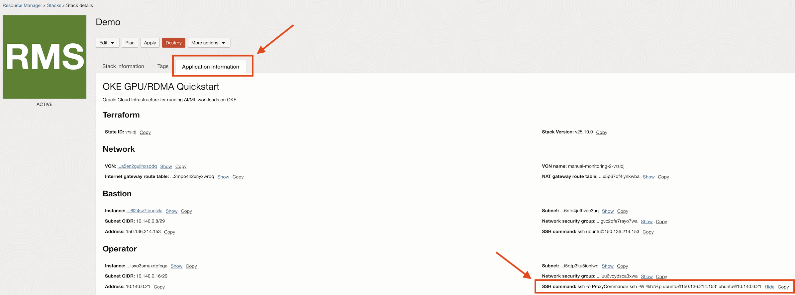

# Running RDMA (Remote Direct Memory Access) GPU Workloads on OKE

This guide provides instructions for deploying and managing GPU workloads with RDMA connectivity on Oracle Cloud Infrastructure Kubernetes Engine (OKE). OKE is a fully-managed, scalable, and highly available Kubernetes service that enables you to deploy containerized applications to the cloud.

## Supported Operating Systems
- Ubuntu 22.04
- Oracle Linux 8 (except for the GPU & RDMA worker pool)

## Required Policies
The following policies are required. The OCI Resource Manager stack will create them for you if you have the necessary permissions. If you don't have the permissions, please refer to the policy documentation below.

- [Policy Configuration for Cluster Creation and Deployment](https://docs.oracle.com/en-us/iaas/Content/ContEng/Concepts/contengpolicyconfig.htm)
- [Creating a Dynamic Group and a Policy for Self-Managed Nodes](https://docs.oracle.com/en-us/iaas/Content/ContEng/Tasks/contengdynamicgrouppolicyforselfmanagednodes.htm)

## Deploying an OKE Cluster with GPUs and RDMA Connectivity

You will need a CPU pool and a GPU pool. The OCI Resource Manager stack deploys a system worker pool by default, and you can choose to deploy additional CPU/GPU worker pools.

You can use the following images for both CPU and GPU pools.

> [!NOTE]  
> The GPU image has the GPU drivers pre-installed.

### Images to Use

You can use the instructions [here](https://docs.oracle.com/en-us/iaas/Content/Compute/Tasks/imageimportexport.htm#Importing) for importing the images below to your tenancy.

#### VM.GPU.A10.1, VM.GPU.A10.2, BM.GPU.A10.4, BM.GPU4.8, BM.GPU.B4.8, BM.GPU.A100-v2.8, BM.GPU.L40S.4, BM.GPU.H100.8, BM.GPU.H200.8, BM.GPU.B200.8

- [GPU driver 580 & CUDA 13.0](https://objectstorage.us-ashburn-1.oraclecloud.com/p/_zoP3rlMMSw56qgjZcneB8Hvdfi358vzGXqmPVM28L_LGNcOF3zX99cOWxyF8q55/n/idxzjcdglx2s/b/oke-images/o/Canonical-Ubuntu-22.04-2025.10.31-0-DOCA-OFED-3.1.0-GPU-580-OPEN-CUDA-13.0-2026.01.16-0)

- [GPU driver 570 & CUDA 12.8](https://objectstorage.ca-montreal-1.oraclecloud.com/p/ts6fjAuj7hY4io5x_jfX3fyC70HRCG8-9gOFqAjuF0KE0s-6tgDZkbRRZIbMZmoN/n/hpc_limited_availability/b/images/o/Canonical-Ubuntu-22.04-2025.05.20-0-OFED-24.10-1.1.4.0-GPU-570-OPEN-CUDA-12.8-2025.07.22-0)


#### BM.GPU.GB200.4

- [GPU driver 580 & CUDA 13.0](https://objectstorage.us-ashburn-1.oraclecloud.com/p/jRqTH2aQhttWHCBG5RvAaK2dZzBmp6xRGx8LzGxlW4Hp2rVjdZ84i0MeihXLFixZ/n/imagegen/b/trroger/o/Canonical-Ubuntu-22.04-aarch64-2025.10.31-0-OCA-DOCA-OFED-3.1.0-GPU-580-OPEN-CUDA-13.0-64K-2025.11.20-0)

- [GPU driver 570 & CUDA 12.8](https://objectstorage.ca-montreal-1.oraclecloud.com/p/ts6fjAuj7hY4io5x_jfX3fyC70HRCG8-9gOFqAjuF0KE0s-6tgDZkbRRZIbMZmoN/n/hpc_limited_availability/b/images/o/Canonical-Ubuntu-22.04-aarch64-2025.05.20-0-DOCA-OFED-3.0.0-GPU-570-OPEN-CUDA-12.8-2025.07.24-0)

#### BM.GPU.GB200-v3.4, BM.GPU.GB300.4

- [GPU driver 580 & CUDA 13.0](https://objectstorage.ca-montreal-1.oraclecloud.com/p/ts6fjAuj7hY4io5x_jfX3fyC70HRCG8-9gOFqAjuF0KE0s-6tgDZkbRRZIbMZmoN/n/hpc_limited_availability/b/images/o/Canonical-Ubuntu-22.04-aarch64-2025.10.31-0-DOCA-OFED-3.1.0-GPU-580-OPEN-CUDA-13.0-CX8-2025.12.20-0)

#### BM.GPU.MI355X-v1.8

- [ROCm 7.1.1](https://objectstorage.us-ashburn-1.oraclecloud.com/p/WvusvolB6r0XyzgKfOgJ5e7P3Sue0TKsF5FBGk1JndUfuQSRb0-UEEaEMl9dkgQs/n/imagegen/b/trroger/o/Canonical-Ubuntu-22.04-2025.10.31-0-OCA-DOCA-OFED-3.1.0-AMD-ROCM-711-2026.01.21-0)

#### BM.GPU.MI300X.8

- [ROCm 7.1.0](https://objectstorage.us-ashburn-1.oraclecloud.com/p/Rrur5toJd81BG-0nmLpi701FRs_PMLb4NhtfBwBlIgP-j2NE_5Dw5JfhR5v-Il_3/n/hpctraininglab/b/bucket-20251028-1826/o/Canonical-Ubuntu-24.04-2025.09.22-0-OCA-DOCA-OFED-3.1.0-AMD-ROCM-710-2025.10.31)

- [ROCm 6.4.3](https://objectstorage.ca-montreal-1.oraclecloud.com/p/ts6fjAuj7hY4io5x_jfX3fyC70HRCG8-9gOFqAjuF0KE0s-6tgDZkbRRZIbMZmoN/n/hpc_limited_availability/b/images/o/Canonical-Ubuntu-22.04-2025.07.23-0-DOCA-OFED-3.1.0-AMD-ROCM-643-2025.09.25-0)


### Deploy the Cluster
You can easily deploy the cluster with the **Deploy to Oracle Cloud** button below, which uses OCI Resource Manager. If you prefer deploying with Terraform locally, you can use the templates in the [terraform directory](./terraform/).

[](https://cloud.oracle.com/resourcemanager/stacks/create?zipUrl=https://github.com/oracle-quickstart/oci-hpc-oke/releases/latest/download/oke-gpu-rdma-quickstart.zip)

### Access the Cluster

You can [access the cluster locally](https://docs.oracle.com/en-us/iaas/Content/ContEng/Tasks/contengdownloadkubeconfigfile.htm) by downloading the `kubeconfig` file.

Alternatively, the template deploys an `operator` instance with the kubeconfig pre-configured and tools like Helm and k9s pre-installed. You can find the SSH command to access the operator node under the **Application information** tab in the OCI Resource Manager stack.



### Verify Node Availability

Wait until all nodes are ready in the cluster:

```sh
kubectl get nodes

NAME           STATUS     ROLES    AGE     VERSION
10.0.103.73    Ready      <none>   2d23h   v1.31.1
10.0.127.206   Ready      node     2d3h    v1.31.1
10.0.127.32    Ready      node     2d3h    v1.31.1
10.0.83.93     Ready      <none>   2d23h   v1.31.1
10.0.96.82     Ready      node     2d23h   v1.31.1
```

### Add a Service Account Authentication Token (Optional but Recommended)

For more information, see [Adding a Service Account Token](https://docs.oracle.com/en-us/iaas/Content/ContEng/Tasks/contengaddingserviceaccttoken.htm).

```sh
kubectl -n kube-system create serviceaccount kubeconfig-sa

kubectl create clusterrolebinding add-on-cluster-admin --clusterrole=cluster-admin --serviceaccount=kube-system:kubeconfig-sa

kubectl apply -f https://raw.githubusercontent.com/oracle-quickstart/oci-hpc-oke/main/manifests/service-account/oke-kubeconfig-sa-token.yaml

TOKEN=$(kubectl -n kube-system get secret oke-kubeconfig-sa-token -o jsonpath='{.data.token}' | base64 --decode)

kubectl config set-credentials kubeconfig-sa --token=$TOKEN

kubectl config set-context --current --user=kubeconfig-sa
```

### Using Host RDMA Network Interfaces in Manifests

To use the RDMA interfaces on the host in your pods, include the following sections in your manifests:

```yaml
spec:
  hostNetwork: true
  dnsPolicy: ClusterFirstWithHostNet
  volumes:
  - { name: devinf, hostPath: { path: /dev/infiniband }}
  - { name: shm, emptyDir: { medium: Memory, sizeLimit: 32Gi }}
```

```yaml
securityContext:
      privileged: true
      capabilities:
        add: [ "IPC_LOCK" ]
```
```yaml
    volumeMounts:
    - { mountPath: /dev/infiniband, name: devinf }
    - { mountPath: /dev/shm, name: shm }
```
Here's a simple example. You can also look at the NCCL test manifests in the repo [here](./manifests/).

```yaml
apiVersion: v1
kind: Pod
metadata:
  name: rdma-test-pod-1
spec:
  hostNetwork: true
  dnsPolicy: ClusterFirstWithHostNet
  volumes:
  - { name: devinf, hostPath: { path: /dev/infiniband }}
  - { name: shm, emptyDir: { medium: Memory, sizeLimit: 32Gi }}
  restartPolicy: OnFailure
  containers:
  - image: oguzpastirmaci/mofed-perftest:5.4-3.6.8.1-ubuntu20.04-amd64
    name: mofed-test-ctr
    securityContext:
      privileged: true
      capabilities:
        add: [ "IPC_LOCK" ]
    volumeMounts:
    - { mountPath: /dev/infiniband, name: devinf }
    - { mountPath: /dev/shm, name: shm }
    resources:
      requests:
        cpu: 8
        ephemeral-storage: 32Gi
        memory: 2Gi
    command:
    - sh
    - -c
    - |
      ls -l /dev/infiniband /sys/class/net
      sleep 1000000
```

## Optional: Deploy Kueue & MPI Operator to Run NCCL Tests

Kueue and MPI Operator are required for running the optional NCCL tests.

### Deploy MPI Operator and Kueue
```sh
kubectl apply --server-side -f https://raw.githubusercontent.com/kubeflow/mpi-operator/v0.7.0/deploy/v2beta1/mpi-operator.yaml

helm install kueue oci://registry.k8s.io/kueue/charts/kueue --version="0.15.2" --create-namespace --namespace=kueue-system
```

### Run the NCCL/RCCL Tests

> [!IMPORTANT]  
> NCCL/RCCL parameters vary by GPU shape. Make sure you are using the manifest that matches your specific bare metal GPU shape.
>
> Also verify that the CUDA major version in the container image matches the CUDA major version installed on the node.

#### NCCL Tests
| Image Tag                                                                 | CUDA   |
|---------------------------------------------------------------------------|--------|
| iad.ocir.io/idxzjcdglx2s/nccl-tests:cuda-13.1.1-ubuntu-24.04-nccl-2.29.3-020926.1 | 13.1.1 |
| iad.ocir.io/idxzjcdglx2s/nccl-tests:cuda-12.9.1-ubuntu-24.04-nccl-2.29.3-020926.1 | 12.9.1 |

#### RCCL Tests
| Image Tag                                                                 | ROCM   |
|---------------------------------------------------------------------------|--------|
| iad.ocir.io/idxzjcdglx2s/rccl-tests:rocm-7.1.1-ubuntu22.04-rccl-2.27.7-012126.1 | 7.1.1 |
| iad.ocir.io/idxzjcdglx2s/rccl-tests:rocm-6.4.4-ubuntu22.04-rccl-2.22.3-011826.1 | 6.4.4 |

#### BM.GPU.GB300.4
```sh
kubectl apply -f https://raw.githubusercontent.com/oracle-quickstart/oci-hpc-oke/main/manifests/nccl-tests/kueue/BM.GPU.GB300.4.yaml
```

#### BM.GPU.GB200-v3.4
```sh
kubectl apply -f https://raw.githubusercontent.com/oracle-quickstart/oci-hpc-oke/main/manifests/nccl-tests/kueue/BM.GPU.GB200-v3.4.yaml
```

#### BM.GPU.GB200-v2.4
```sh
kubectl apply -f https://raw.githubusercontent.com/oracle-quickstart/oci-hpc-oke/main/manifests/nccl-tests/kueue/BM.GPU.GB200-v2.4.yaml
```

#### BM.GPU.GB200.4
```sh
kubectl apply -f https://raw.githubusercontent.com/oracle-quickstart/oci-hpc-oke/main/manifests/nccl-tests/kueue/BM.GPU.GB200.4.yaml
```

#### BM.GPU.B200.8
```sh
kubectl apply -f https://raw.githubusercontent.com/oracle-quickstart/oci-hpc-oke/main/manifests/nccl-tests/kueue/BM.GPU.B200.8.yaml
```

#### BM.GPU.H200
```sh
kubectl apply -f https://raw.githubusercontent.com/oracle-quickstart/oci-hpc-oke/main/manifests/nccl-tests/kueue/BM.GPU.H200.8.yaml
```

#### BM.GPU.H100
```sh
kubectl apply -f https://raw.githubusercontent.com/oracle-quickstart/oci-hpc-oke/main/manifests/nccl-tests/kueue/BM.GPU.H100.8.yaml
```

#### BM.GPU.A100-v2.8
```sh
kubectl apply -f https://raw.githubusercontent.com/oracle-quickstart/oci-hpc-oke/main/manifests/nccl-tests/kueue/BM.GPU.A100-v2.8.yaml
```

#### BM.GPU4.8
```sh
kubectl apply -f https://raw.githubusercontent.com/oracle-quickstart/oci-hpc-oke/main/manifests/nccl-tests/kueue/BM.GPU4.8.yaml
```

#### BM.GPU.B4.8
```sh
kubectl apply -f https://raw.githubusercontent.com/oracle-quickstart/oci-hpc-oke/main/manifests/nccl-tests/kueue/BM.GPU.B4.8.yaml
```

#### BM.GPU.MI355X-v1.8
```sh
kubectl apply -f https://raw.githubusercontent.com/oracle-quickstart/oci-hpc-oke/main/manifests/rccl-tests/kueue/BM.GPU.MI355X-v1.8.yaml
```
#### BM.GPU.MI300X.8
```sh
kubectl apply -f https://raw.githubusercontent.com/oracle-quickstart/oci-hpc-oke/main/manifests/rccl-tests/kueue/BM.GPU.MI300X.8.yaml
```

The initial container image pull may take some time. Once the launcher pod `nccl-test-launcher-XXXXX` starts running, you can check its logs for the NCCL test results.

### Example Output

```sh
Waiting for workers to be ready...
All workers are ready!
Warning: Permanently added '[nccl-test-worker-1.nccl-test.default.svc]:2222' (ED25519) to the list of known hosts.
Warning: Permanently added '[nccl-test-worker-0.nccl-test.default.svc]:2222' (ED25519) to the list of known hosts.
# nThread 1 nGpus 1 minBytes 1073741824 maxBytes 4294967296 step: 2(factor) warmup iters: 5 iters: 20 agg iters: 1 validation: 1 graph: 0
#
# Using devices
#  Rank  0 Group  0 Pid     88 on inst-fufd1-oke-rdma device  0 [0000:0f:00] NVIDIA A100-SXM4-40GB
#  Rank  1 Group  0 Pid     89 on inst-fufd1-oke-rdma device  1 [0000:15:00] NVIDIA A100-SXM4-40GB
#  Rank  2 Group  0 Pid     90 on inst-fufd1-oke-rdma device  2 [0000:51:00] NVIDIA A100-SXM4-40GB
#  Rank  3 Group  0 Pid     91 on inst-fufd1-oke-rdma device  3 [0000:54:00] NVIDIA A100-SXM4-40GB
#  Rank  4 Group  0 Pid     92 on inst-fufd1-oke-rdma device  4 [0000:8d:00] NVIDIA A100-SXM4-40GB
#  Rank  5 Group  0 Pid     93 on inst-fufd1-oke-rdma device  5 [0000:92:00] NVIDIA A100-SXM4-40GB
#  Rank  6 Group  0 Pid     94 on inst-fufd1-oke-rdma device  6 [0000:d6:00] NVIDIA A100-SXM4-40GB
#  Rank  7 Group  0 Pid     95 on inst-fufd1-oke-rdma device  7 [0000:da:00] NVIDIA A100-SXM4-40GB
#  Rank  8 Group  0 Pid     88 on inst-aqu5j-oke-rdma device  0 [0000:0f:00] NVIDIA A100-SXM4-40GB
#  Rank  9 Group  0 Pid     89 on inst-aqu5j-oke-rdma device  1 [0000:15:00] NVIDIA A100-SXM4-40GB
#  Rank 10 Group  0 Pid     90 on inst-aqu5j-oke-rdma device  2 [0000:51:00] NVIDIA A100-SXM4-40GB
#  Rank 11 Group  0 Pid     91 on inst-aqu5j-oke-rdma device  3 [0000:54:00] NVIDIA A100-SXM4-40GB
#  Rank 12 Group  0 Pid     92 on inst-aqu5j-oke-rdma device  4 [0000:8d:00] NVIDIA A100-SXM4-40GB
#  Rank 13 Group  0 Pid     93 on inst-aqu5j-oke-rdma device  5 [0000:92:00] NVIDIA A100-SXM4-40GB
#  Rank 14 Group  0 Pid     94 on inst-aqu5j-oke-rdma device  6 [0000:d6:00] NVIDIA A100-SXM4-40GB
#  Rank 15 Group  0 Pid     96 on inst-aqu5j-oke-rdma device  7 [0000:da:00] NVIDIA A100-SXM4-40GB
NCCL version 2.25.1+cuda12.8
#
#                                                              out-of-place                       in-place          
#       size         count      type   redop    root     time   algbw   busbw #wrong     time   algbw   busbw #wrong
#        (B)    (elements)                               (us)  (GB/s)  (GB/s)            (us)  (GB/s)  (GB/s)       
  1073741824     268435456     float     sum      -1    10776   99.64  186.83      0    10781   99.60  186.75      0
  2147483648     536870912     float     sum      -1    21287  100.88  189.15      0    21299  100.82  189.05      0
  4294967296    1073741824     float     sum      -1    42381  101.34  190.02      0    42364  101.38  190.09      0
# Out of bounds values : 0 OK
# Avg bus bandwidth    : 188.648 
#
```

## Guides

- [Adding SSH keys to worker nodes](./docs/adding-ssh-keys-to-worker-nodes.md)
- [Deploying the Monitoring Stack manually](./docs/deploying-monitoring-stack-manually.md)
- [Running GPU & RDMA active health checks](./docs/running-active-health-checks.md)
- [Running GPU & RDMA passive health checks](./docs/running-gpu-rdma-healthchecks-with-node-problem-detector.md)
- [Using RDMA Network Locality When Running Workloads on OKE](./docs/using-rdma-network-locality-when-running-workloads-on-oke.md)
- [Running PyTorch Jobs on OKE Using Host Network with RDMA](./docs/running-pytorch-jobs-on-oke-using-hostnetwork-with-rdma.md)
- [Using Cluster Autoscaler with Cluster Networks](./docs/using-cluster-autoscaler-with-cluster-networks.md)
- [Importing Container Images from OCI File Storage Service Using Skopeo](./docs/importing-images-from-fss-skopeo.md)
- [Replacing the boot volume of self-managed nodes using the Boot Volume Replacement (BVR) script](./docs/replacing-the-boot-volume-of-self-managed-nodes.md)

## Contributing

This project welcomes contributions from the community. Before submitting a pull request, please [review our contribution guide](./CONTRIBUTING.md).

## Security

Please consult the [security guide](./SECURITY.md) for our responsible security vulnerability disclosure process.
