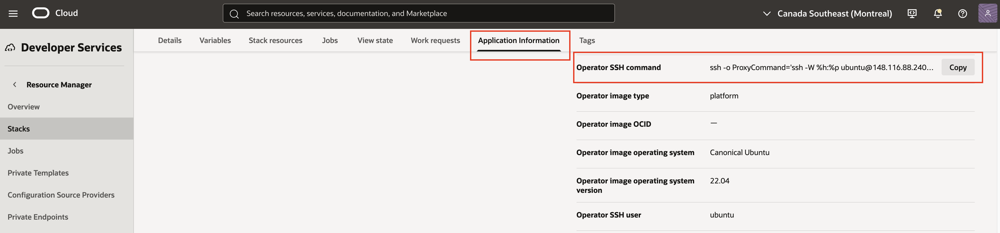

# Running RDMA (Remote Direct Memory Access) GPU Workloads on OKE

This guide provides instructions for deploying and managing GPU workloads with RDMA connectivity on Oracle Cloud Infrastructure Kubernetes Engine (OKE). OKE is a fully-managed, scalable, and highly available Kubernetes service that enables you to deploy containerized applications to the cloud.

## Supported Operating Systems
- Ubuntu 22.04
- Ubuntu 24.04
- Oracle Linux 8 (except for the GPU with RDMA & GPU Memory Cluster worker pools)

## Required Policies
The following policies are required. The OCI Resource Manager stack will create them for you if you have the necessary permissions. If you don't have the permissions, please refer to the policy documentation below.

- [Policy Configuration for Cluster Creation and Deployment](https://docs.oracle.com/en-us/iaas/Content/ContEng/Concepts/contengpolicyconfig.htm)
- [Creating a Dynamic Group and a Policy for Self-Managed Nodes](https://docs.oracle.com/en-us/iaas/Content/ContEng/Tasks/contengdynamicgrouppolicyforselfmanagednodes.htm)

## Deploying an OKE Cluster with GPUs and RDMA Connectivity

You will need a CPU pool and a GPU pool. The OCI Resource Manager stack deploys a system worker pool by default, and you can choose to deploy additional CPU/GPU worker pools.

> [!NOTE]  
> Use the images listed in [Images to Use for Worker Nodes](./docs/worker-node-images.md) for **all** worker pools in the cluster (system, CPU, GPU, and RDMA). These images include GPU drivers, the Lustre client, and other components required by this stack.

### Deploy the Cluster
You can easily deploy the cluster with the **Deploy to Oracle Cloud** button below, which uses OCI Resource Manager. If you prefer deploying with Terraform locally, you can use the templates in the [terraform directory](./terraform/).

[](https://cloud.oracle.com/resourcemanager/stacks/create?zipUrl=https://github.com/oracle-quickstart/oci-hpc-oke/releases/latest/download/oke-gpu-rdma-quickstart.zip)

### Access the Cluster

You can [access the cluster locally](https://docs.oracle.com/en-us/iaas/Content/ContEng/Tasks/contengdownloadkubeconfigfile.htm) by downloading the `kubeconfig` file.

Alternatively, the template deploys an `operator` instance with the kubeconfig pre-configured and tools like Helm and k9s pre-installed. You can find the SSH command to access the operator node under the **Application information** tab in the OCI Resource Manager stack.

You can also access the cluster directly from your local machine via the OCI Bastion Service. The template creates a bastion service and provides a ready-to-run command under the **Application information** tab. See [Accessing a Private OKE Cluster via OCI Bastion Service](docs/accessing-private-oke-cluster-via-oci-bastion-service.md) for details.



### Verify Node Availability

Wait until all nodes are ready in the cluster:

```sh
kubectl get nodes

NAME           STATUS     ROLES    AGE     VERSION
10.0.103.73    Ready      <none>   2d23h   v1.35.2
10.0.127.206   Ready      node     2d3h    v1.35.2
10.0.127.32    Ready      node     2d3h    v1.35.2
10.0.83.93     Ready      <none>   2d23h   v1.35.2
10.0.96.82     Ready      node     2d23h   v1.35.2
```

### Using RDMA Network Interfaces in Manifests

To use the RDMA interfaces in your pods, see [Using RDMA Network Interfaces in Manifests](./docs/using-rdma-network-interfaces-in-manifests.md) for the required manifest sections and complete examples using `hostNetwork` or SR-IOV virtual functions.

## Optional: Deploy Kueue & MPI Operator to Run NCCL Tests

Kueue and MPI Operator are required for running the optional NCCL/RCCL tests.

> [!NOTE]
> Starting with stack v26.3.0, Kueue and MPI Operator are deployed by default.

See [Running NCCL and RCCL Tests with Kueue and MPI Operator](./docs/running-nccl-rccl-tests-with-kueue.md) for deployment steps, per-shape test manifests, and example output.

## Guides

- [Accessing a Private OKE Cluster via OCI Bastion Service](./docs/accessing-private-oke-cluster-via-oci-bastion-service.md)
- [Adding SSH keys to worker nodes](./docs/adding-ssh-keys-to-worker-nodes.md)
- [Deploying the Monitoring Stack manually](./docs/deploying-monitoring-stack-manually.md)
- [Onboarding Users to the Slurm Operator](./docs/slurm-operator-user-onboarding.md)
- [Images to Use for Worker Nodes](./docs/worker-node-images.md)
- [Importing Container Images from OCI File Storage Service Using Skopeo](./docs/importing-images-from-fss-skopeo.md)
- [OCI HPC OKE Utils (Node Labeler, Slurm Topology, Image Prepuller, Hostexec)](./docs/oci-hpc-oke-utils.md)
- [Replacing the boot volume of self-managed nodes and managed node pools using the Boot Volume Replacement (BVR) script](./docs/replacing-the-boot-volume-of-self-managed-nodes.md)
- [Running GPU & RDMA active health checks](./docs/running-active-health-checks.md)
- [Running GPU & RDMA passive health checks](./docs/running-gpu-rdma-healthchecks-with-node-problem-detector.md)
- [Running ib_write_bw Tests Between Nodes](./docs/running-ib-write-bw-test.md)
- [Running NCCL and RCCL Tests from the Slurm Operator](./docs/running-nccl-rccl-tests-from-slurm-operator.md)
- [Running NCCL and RCCL Tests with Kueue and MPI Operator](./docs/running-nccl-rccl-tests-with-kueue.md)
- [Running PyTorch Jobs on OKE Using Host Network with RDMA](./docs/running-pytorch-jobs-on-oke-using-hostnetwork-with-rdma.md)
- [Upgrading OKE clusters](./docs/oke-hpc-upgrade.md)
- [Using Cluster Autoscaler with Cluster Networks](./docs/using-cluster-autoscaler-with-cluster-networks.md)
- [Using Dynamic Resource Allocation (DRA) for Multi-Node NVLink](./docs/using-dynamic-resource-allocation-for-multi-node-nvlink-imex.md)
- [Using RDMA Network Interfaces in Manifests](./docs/using-rdma-network-interfaces-in-manifests.md)
- [Using RDMA Network Locality When Running Workloads on OKE](./docs/using-rdma-network-locality-when-running-workloads-on-oke.md)
- [Using the NCCL/RCCL Parameters ConfigMap in Job Manifests](./docs/using-nccl-rccl-parameters-configmap.md)
- [CVE-2026-31431 ("Copy Fail")](./docs/copy-fail.md)
- [Dirty Frag: CVE-2026-43284, CVE-2026-43500](./docs/dirty-frag.md)

## Contributing

This project welcomes contributions from the community. Before submitting a pull request, please [review our contribution guide](./CONTRIBUTING.md).

## Security

Please consult the [security guide](./SECURITY.md) for our responsible security vulnerability disclosure process.
