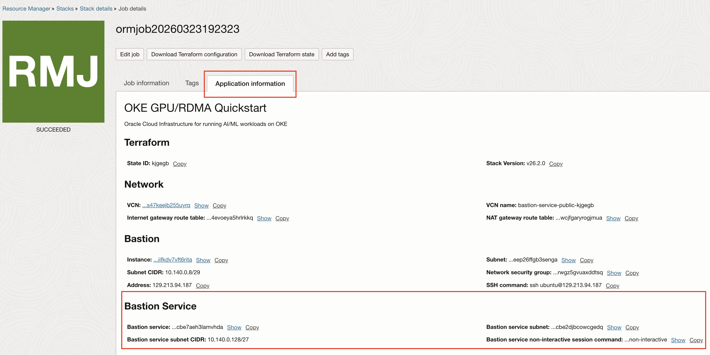

# Accessing a Private OKE Cluster via OCI Bastion Service

This guide explains how to use the `oke-bastion-service-session.sh` script to access a private OKE cluster endpoint through an OCI Bastion Service port-forwarding session. The script creates a bastion session, establishes an SSH tunnel to the OKE private endpoint, and generates a kubeconfig pointing to the local tunnel.

## Prerequisites

- [OCI CLI](https://docs.oracle.com/en-us/iaas/Content/API/SDKDocs/cliinstall.htm) installed and configured
- [kubectl](https://kubernetes.io/docs/tasks/tools/#kubectl) installed
- `ssh` installed
- `lsof` or `ss` installed (for port availability checks)
- An SSH keypair (`~/.ssh/id_rsa` and `~/.ssh/id_rsa.pub` by default)

## Quick Start

> [!TIP]
> If you're here to connect to your cluster, start here.

<details>
<summary><strong>If you deployed the stack using OCI Resource Manager</strong></summary>

### Step 1: Get the Script

Download the script directly:

```sh
curl -LO https://raw.githubusercontent.com/oracle-quickstart/oci-hpc-oke/main/files/oke-bastion-service-session.sh
chmod +x oke-bastion-service-session.sh
```

### Step 2: Get the Session Command from OCI Console

In the OCI Console, navigate to your Resource Manager stack job and open the **Application Information** tab. Copy the value of **Bastion service non-interactive session** command.



The command will look like this:

```sh
./oke-bastion-service-session.sh \
  --bastion-ocid ocid1.bastion.oc1.iad.amaaaaaa2bemolaa66wfsz2y5ujwtw674fjadttnf5nkxcbe7aeh3lamvhda \
  --cluster-ocid ocid1.cluster.oc1.iad.aaaaaaaaa62abxyehozslx23nm55hy2tv4jlxxlhbqspwb6fdcklrj65ncxq \
  --oke-endpoint-ip 10.140.0.3 \
  --region us-ashburn-1 \
  --profile DEFAULT \
  --ssh-key ~/.ssh/id_rsa \
  --local-port 6443 \
  --ttl-seconds 10800 \
  --auto-tunnel \
  --non-interactive
```

Run it directly to create the session, start the tunnel, and generate the kubeconfig.

### Step 3: Connect to the Cluster

Once the script completes, export the kubeconfig path printed in the output and verify access:

```sh
export KUBECONFIG=~/.kube/oke-bastion/<cluster-ocid>.yaml
kubectl get nodes
```

</details>

<details>
<summary><strong>If you deployed the stack using local Terraform</strong></summary>

### Step 1: Get the Script

The script is in the `files/` directory of your local clone. Change to that directory before running commands:

```sh
cd files
```

### Step 2: Get the Session Command from Terraform Output

The full script invocation is available as a Terraform output:

```sh
terraform output -raw bastion_service_session_command
```

The command will look like this:

```sh
./oke-bastion-service-session.sh \
  --bastion-ocid ocid1.bastion.oc1.iad.amaaaaaa2bemolaa66wfsz2y5ujwtw674fjadttnf5nkxcbe7aeh3lamvhda \
  --cluster-ocid ocid1.cluster.oc1.iad.aaaaaaaaa62abxyehozslx23nm55hy2tv4jlxxlhbqspwb6fdcklrj65ncxq \
  --oke-endpoint-ip 10.140.0.3 \
  --region us-ashburn-1 \
  --profile DEFAULT \
  --ssh-key ~/.ssh/id_rsa \
  --local-port 6443 \
  --ttl-seconds 10800 \
  --auto-tunnel \
  --non-interactive
```

Run this command directly to create the session, start the tunnel, and generate the kubeconfig.

### Step 3: Connect to the Cluster

Once the script completes, export the kubeconfig path printed in the output and verify access:

```sh
export KUBECONFIG=~/.kube/oke-bastion/<cluster-ocid>.yaml
kubectl get nodes
```

</details>

## Overview

The script supports two modes for starting the SSH tunnel:

- **Auto-tunnel** (`--auto-tunnel`): The script starts the SSH tunnel in the background and writes the kubeconfig automatically. This is the recommended mode.
- **Manual tunnel**: The script prints the SSH command for you to run in a separate terminal, then generates the kubeconfig.

Inputs can be provided as CLI flags, environment variables, or interactive prompts.

## Usage Options

### Running Non-Interactively (Scripted)

Pass all required values as flags:

```sh
./oke-bastion-service-session.sh \
  --bastion-ocid ocid1.bastion.oc1.iad.amaaaaaa... \
  --cluster-ocid ocid1.cluster.oc1.iad.aaaaaaaaa... \
  --oke-endpoint-ip 10.140.0.4 \
  --region us-ashburn-1 \
  --profile DEFAULT \
  --ssh-key ~/.ssh/id_rsa \
  --local-port 6443 \
  --ttl-seconds 10800 \
  --auto-tunnel \
  --non-interactive
```

### Running Interactively

Run the script with only the flags you want to fix, and it will prompt for any missing required values:

```sh
./oke-bastion-service-session.sh --auto-tunnel
```

You will be prompted for:
- Bastion OCID
- OKE Cluster OCID
- OKE private endpoint IP
- OCI region (optional, leave blank to use CLI default)
- OCI CLI profile (optional, leave blank to use default)

### Using Environment Variables

Export values as environment variables and the script will use them without prompting:

```sh
export BASTION_OCID=ocid1.bastion.oc1.iad.amaaaaaa...
export CLUSTER_OCID=ocid1.cluster.oc1.iad.aaaaaaaaa...
export OKE_ENDPOINT_IP=10.140.0.4
export REGION=us-ashburn-1
export PROFILE=DEFAULT

./oke-bastion-service-session.sh --auto-tunnel --non-interactive
```

### Manual Tunnel Mode

Without `--auto-tunnel`, the script prints the SSH command and exits after generating the kubeconfig. Run the printed SSH command in a separate terminal to start the tunnel:

```sh
./oke-bastion-service-session.sh \
  --bastion-ocid ocid1.bastion.oc1.iad.amaaaaaa... \
  --cluster-ocid ocid1.cluster.oc1.iad.aaaaaaaaa... \
  --oke-endpoint-ip 10.140.0.4 \
  --non-interactive
```

The script prints:

```
── SSH tunnel command ──
Run the following command in another terminal to start the tunnel:

  ssh -i ~/.ssh/id_rsa -N -L 6443:10.140.0.4:6443 ... ocid1.bastionsession...@host.bastion.us-ashburn-1.oci.oraclecloud.com
```

### Reusing an Existing Session

If you already have an active bastion session, pass its OCID with `--session-id` to skip session creation:

```sh
./oke-bastion-service-session.sh \
  --session-id ocid1.bastionsession.oc1.iad.amaaaaaa... \
  --cluster-ocid ocid1.cluster.oc1.iad.aaaaaaaaa... \
  --oke-endpoint-ip 10.140.0.4 \
  --auto-tunnel \
  --non-interactive
```

### Custom Kubeconfig Path

By default, the kubeconfig is written to `~/.kube/oke-bastion/<cluster-ocid>.yaml`. To use a custom path:

```sh
./oke-bastion-service-session.sh \
  --kubeconfig ~/my-cluster.yaml \
  ...
```

## Cleanup

### Stop the Tunnel and Delete the Session

The setup summary printed at the end of a successful run includes the exact cleanup command, including region and profile:

```sh
./oke-bastion-service-session.sh \
  --cleanup-session ocid1.bastionsession.oc1.iad.amaaaaaa... \
  --region us-ashburn-1 \
  --profile DEFAULT
```

This kills the background SSH tunnel process and deletes the bastion session.

### Delete the Kubeconfig Only

To remove the generated kubeconfig without touching the session:

```sh
./oke-bastion-service-session.sh \
  --cleanup-kubeconfig \
  --cluster-ocid ocid1.cluster.oc1.iad.aaaaaaaaa...
```

## All Flags

| Flag | Description | Default |
|------|-------------|---------|
| `--bastion-ocid` | OCI Bastion OCID | — |
| `--cluster-ocid` | OKE Cluster OCID | — |
| `--oke-endpoint-ip` | OKE private endpoint IP | — |
| `--region` | OCI region | CLI default |
| `--profile` | OCI CLI profile | `DEFAULT` |
| `--ssh-key` | Path to SSH private key | `~/.ssh/id_rsa` |
| `--local-port` | Local port for the tunnel | `6443` |
| `--target-port` | Target port on the OKE endpoint | `6443` |
| `--ttl-seconds` | Session TTL in seconds (max 10800) | `10800` |
| `--kubeconfig` | Custom kubeconfig output path | `~/.kube/oke-bastion/<cluster-ocid>.yaml` |
| `--auto-tunnel` | Start SSH tunnel in background automatically | off |
| `--session-id` | Reuse an existing bastion session | — |
| `--non-interactive` | Fail fast if required inputs are missing | off |
| `--cleanup-session` | Delete a session and stop its tunnel | — |
| `--cleanup-kubeconfig` | Delete the generated kubeconfig | — |

## Troubleshooting

### "Permission denied (publickey)" on First Connection

OCI Bastion occasionally marks a session as `ACTIVE` before the SSH endpoint is ready to authenticate. The script automatically retries the SSH connection up to 3 times with a 10-second delay between attempts.

If all retries fail, clean up the session and try again:

```sh
./oke-bastion-service-session.sh \
  --cleanup-session ocid1.bastionsession.oc1.iad.amaaaaaa... \
  --region us-ashburn-1 \
  --profile DEFAULT
```

### "Port is already in use"

Port 6443 (or the port specified by `--local-port`) is already bound. Either use a different port with `--local-port`, or identify and stop the process holding it:

```sh
lsof -iTCP:6443 -sTCP:LISTEN
```

### "OCI CLI authentication failed"

Verify your OCI CLI configuration:

```sh
oci iam region list
```

If this fails, check your config file at `~/.oci/config` or re-run `oci setup config`. See the [OCI CLI documentation](https://docs.oracle.com/en-us/iaas/Content/API/SDKDocs/cliinstall.htm) for setup instructions.

### Session Deleted Unexpectedly

If the script exits unexpectedly after creating a session, it prints a cleanup command to stderr:

```
Script exited unexpectedly. To clean up the bastion session:
  ./oke-bastion-service-session.sh --cleanup-session ocid1.bastionsession... --region us-ashburn-1 --profile DEFAULT
```

Run that command to delete the orphaned session.
