# OCI HPC OKE - Architecture and Sequence Diagrams

Here's how the OKE stack fits together, from creating the cluster and booting workers to running GPU jobs and viewing their metrics. The diagrams follow the Terraform configuration, scripts, and Kubernetes manifests at revision `2548a59da6d3059aeffc1137bf86f8a026d3998a`.

Which pieces run depends on the options you enable. Terraform handles the dependencies between them, so some provisioning steps can run alongside each other. Source links below each diagram point to the files behind the flow.

## Deployment paths and worker pools

The stack has three ways to reach the Kubernetes API. [oke-cluster.tf](../terraform/oke-cluster.tf) selects the path, and [provider.tf](../terraform/provider.tf) sets up the connection.

| Path | Source condition | Kubernetes access |
| --- | --- | --- |
| Operator | `create_bastion && create_operator && !control_plane_is_public && !deploy_to_oke_from_orm` | SSH through the bastion to the operator; remote Helm and kubectl |
| Local providers | `!deploy_from_operator && control_plane_is_public && !deploy_to_oke_from_orm` | Terraform Helm, Kubernetes, and kubectl providers |
| Resource Manager (ORM) | `current_user_ocid != null && deploy_to_oke_from_orm` | Providers use the ORM private endpoint reachable IP |

Each optional component also has its own install settings. Slinky's operator path works a little differently; diagram 10 covers that setup.

The [worker pool definitions](../terraform/oke-workers.tf) pass these modes to `oracle-terraform-modules/oke/oci` version `5.5.1`:

| Pool | Mode and condition |
| --- | --- |
| `oke-system` | Managed `node-pool`; creation enabled, size from `worker_ops_pool_size` |
| `oke-cpu` | Managed `node-pool` when `worker_cpu_enabled` |
| `oke-gpu` | Managed `node-pool` when `worker_gpu_enabled` |
| `oke-rdma` | When enabled and the image is valid: `cluster-network` if `worker_rdma_use_cluster_network`, otherwise `node-pool` with `use_compute_cluster = true` |
| `oke-gmc` | Self-managed `gpu-memory-cluster` when `worker_gmc_enabled`; fabric IDs and scale configuration are passed to the module |

## Sequence Diagrams

### 1. Terraform Apply - Provisioning Overview

An apply brings together the network, cluster, worker pools, storage, and enabled add-ons. You can create a new VCN or use an existing network. Terraform uses the outputs from each resource to connect the pieces as they become available.

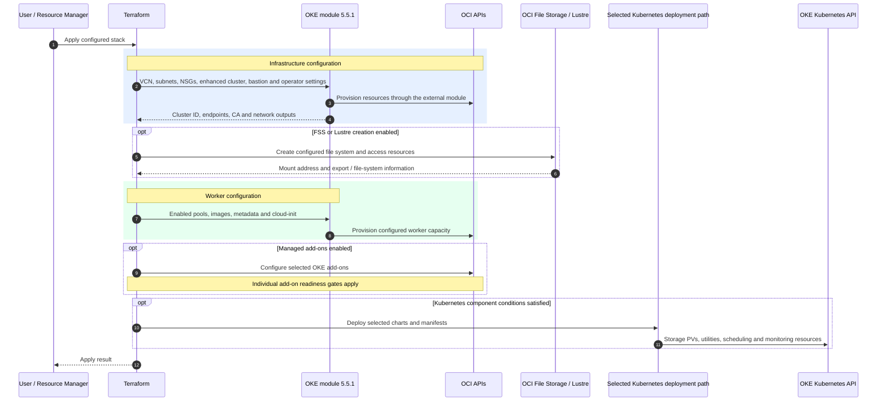

Sources: [cluster and module configuration](../terraform/oke-cluster.tf), [workers and cloud-init](../terraform/oke-workers.tf), [managed add-ons and readiness gates](../terraform/oke-addons.tf), [FSS](../terraform/fss.tf), [Lustre](../terraform/lustre.tf).

### 2. Kubernetes Deployment - Operator, Local and ORM Paths

For a private cluster, Terraform connects through the bastion and runs Helm and kubectl on the operator host. Local and ORM deployments use Terraform providers to reach the API directly through their configured endpoint. Each component adds the checks it needs before installation.

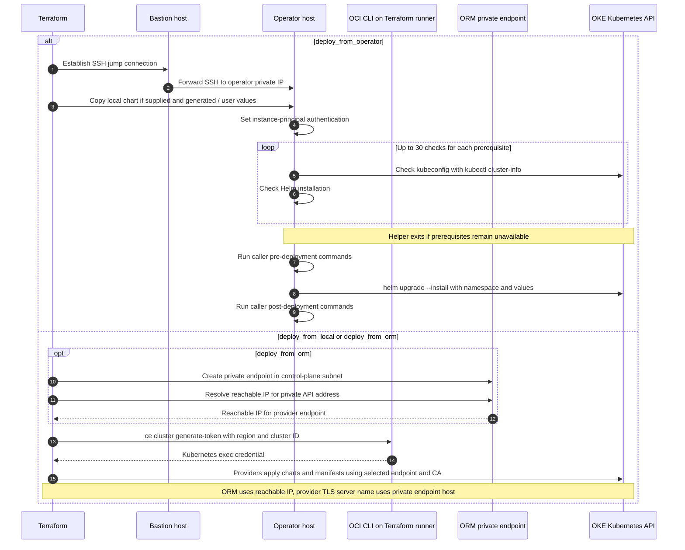

The Helm helper loads generated values first, then your overrides if you've supplied any. It checks kubeconfig and Helm separately, waiting ten seconds between retries. Each component chooses its own Helm flags, including whether to use `--wait`.

Sources: [deployment selectors](../terraform/oke-cluster.tf), [Helm helper](../terraform/helm-module/helm-deployment.tf), [providers](../terraform/provider.tf), [ORM endpoint](../terraform/orm-private-endpoint.tf).

### 3. Worker Node Boot Sequence

Every worker pool gets the stack's generated cloud-config in place of the module default. It sets up the node, runs the OKE bootstrap, and mounts any enabled storage. Despite its name, `oke-ubuntu-cloud-init.sh` handles both Ubuntu and Oracle Linux.

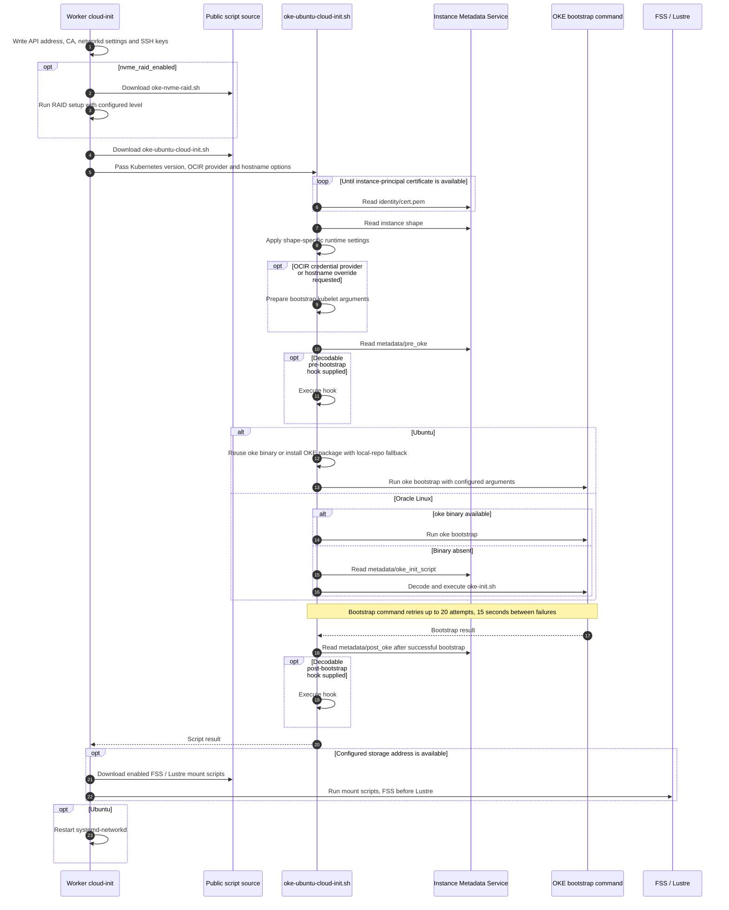

Workers download these scripts from `refs/heads/main` when they boot. The scripts give GPU shapes unlimited CRI-O memlock and disable an existing host `nvidia-imex` service on GB200/GB300 shapes for DRA compatibility. Bootstrap and mount failures are logged by the command wrappers, which allow cloud-init to continue.

Sources: [cloud-config and command order](../terraform/oke-workers.tf), [bootstrap script](../files/oke-ubuntu-cloud-init.sh), [default cloud-init override](../terraform/oke-cluster.tf).

### 4. Shared Storage - Infrastructure, Host Mounts and Kubernetes PVs

The same file system can be mounted on the worker host and exposed to Kubernetes through a PersistentVolume (PV). The stack sets up both paths from the storage address and export details. Workloads use their own PersistentVolumeClaims (PVCs) to request the Kubernetes volume.

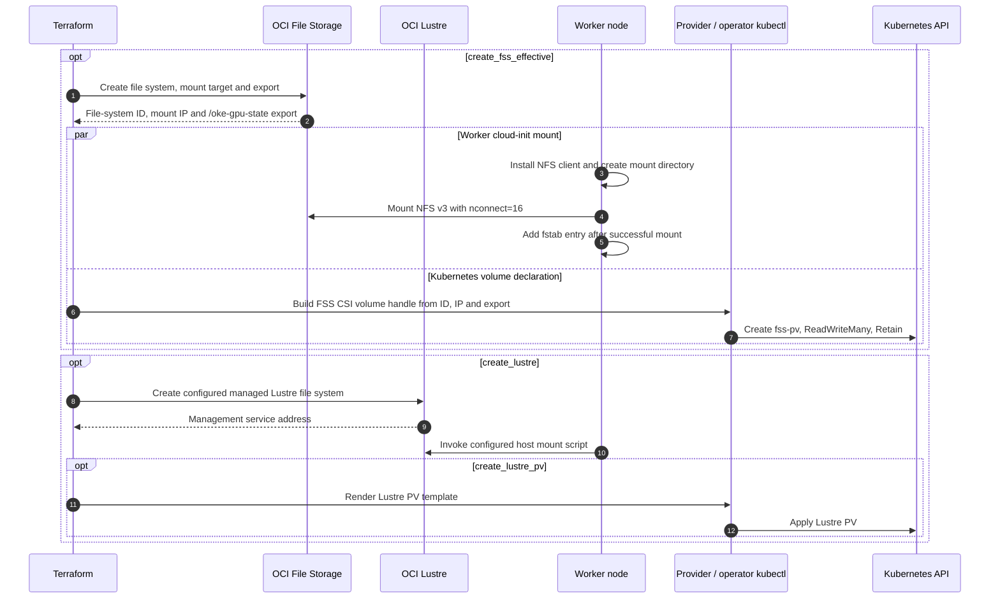

FSS is created when you enable `create_fss`, or when Slinky needs its default `fss-pv` home volume. The PV uses the `Retain` reclaim policy, while the OCI file system itself stays under Terraform's lifecycle management.

Sources: [FSS resources and PV](../terraform/fss.tf), [operator FSS PV](../terraform/via-operator-fss.tf), [NFS mount script](../files/oke-fss-mount.sh), [Lustre resources](../terraform/lustre.tf), [Lustre host mount](../files/oke-lustre-mount.sh), [provider Lustre PV](../terraform/via-provider-lustre-client.tf), [operator Lustre PV](../terraform/via-operator-lustre.tf).

### 5. Node Topology Labeling - Runtime Reconciliation

When enabled, the `oci-hpc-oke-utils` labeler reads each node's metadata and keeps its Kubernetes topology labels up to date. A separate controller adds host and maintenance information from the OCI API.

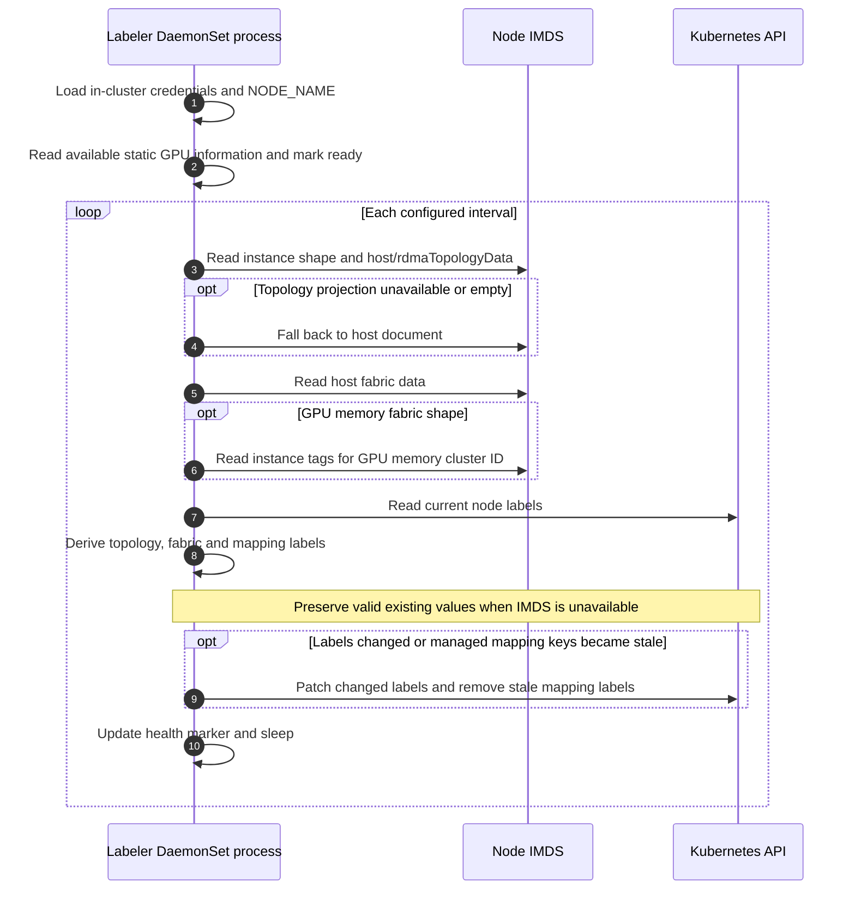

Topology labels use the last 11 characters of the IDs returned by IMDS. If metadata is temporarily unavailable, the labeler keeps any valid labels it already has and uses `no-imds-data` for missing values. Label updates run in the background after the labeler marks itself ready.

Sources: [labeler implementation](../terraform/files/oci-hpc-oke-utils/templates/labeler-configmap.yaml), [DaemonSet](../terraform/files/oci-hpc-oke-utils/templates/labeler.yaml), [chart values](../terraform/files/oci-hpc-oke-utils/values.yaml), [separate controller implementation](../terraform/files/oci-hpc-oke-utils/templates/controller-configmap.yaml).

### 6. Kueue Installation and RDMA Queue Configuration

The stack installs Kueue and checks its webhook before creating queues. If you've enabled an RDMA or GMC pool, it also sets up the topology and resource flavor used by the RDMA queues.

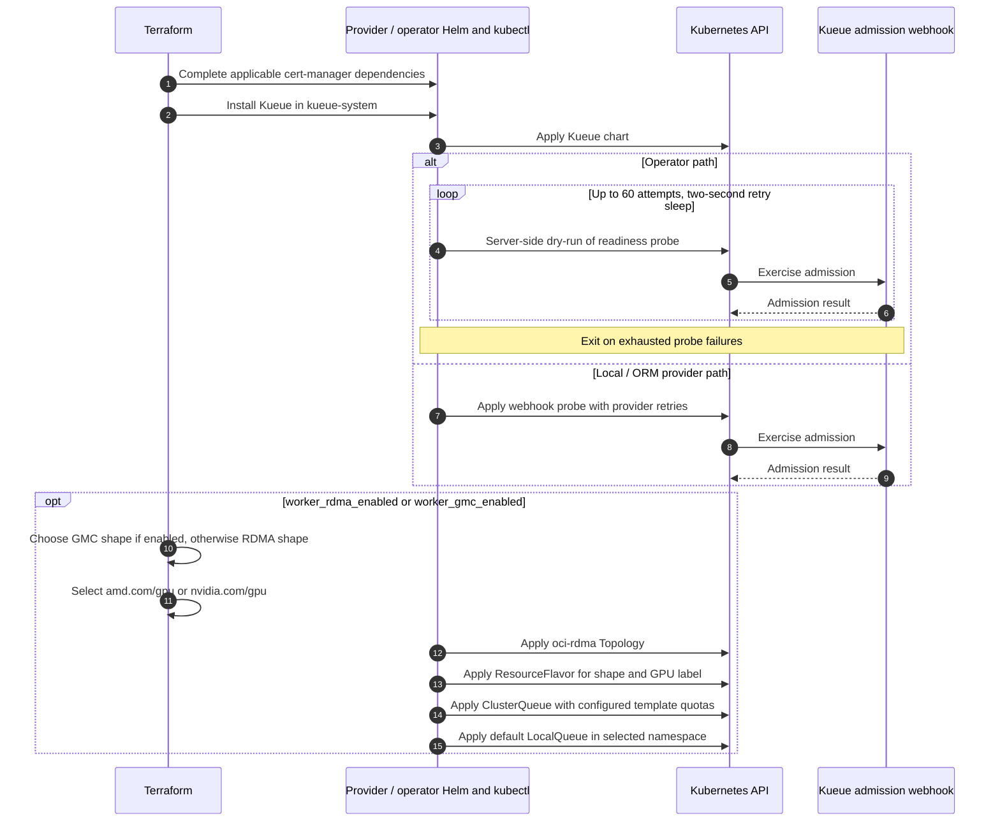

The topology groups nodes by HPC island, network block, local block, and hostname. The ResourceFlavor connects that topology to the selected instance shape and GPU label. Queue quotas come from fixed values in the template. On the provider path, the chart uses `wait = false`, and the webhook probe checks that admission is ready before setup continues.

Sources: [provider Kueue resources](../terraform/via-provider-kueue.tf), [operator Kueue resources](../terraform/via-operator-kueue.tf), [Topology](../terraform/files/kueue/topology.yaml), [ResourceFlavor](../terraform/files/kueue/resource-flavor.yaml.tpl), [ClusterQueue](../terraform/files/kueue/cluster-queue.yaml.tpl), [LocalQueue](../terraform/files/kueue/local-queue.yaml.tpl).

### 7. NCCL MPIJob - Manifest and Launcher Execution

Once Kueue and MPI Operator are installed, you can submit the H100 NCCL example. It includes its own resource flavor and queues alongside the MPIJob. The launcher waits for the workers, then starts the benchmark across them.

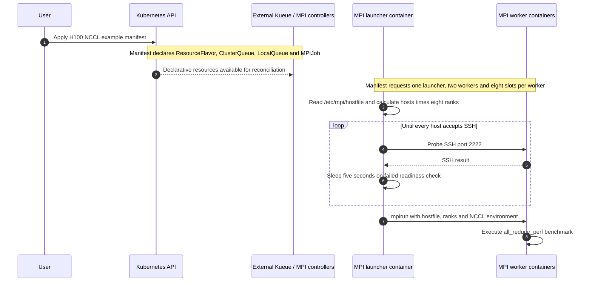

The manifest brings together host networking, shape selection, GPU requests, and RDMA settings for the benchmark. For AMD nodes, the RCCL examples provide their own images and parameters.

Sources: [H100 NCCL manifest](../manifests/nccl-tests/kueue/BM.GPU.H100.8.yaml), [MI300X RCCL manifest](../manifests/rccl-tests/kueue/BM.GPU.MI300X.8.yaml), [provider MPI Operator installation](../terraform/via-provider-mpi-operator.tf), [operator MPI Operator installation](../terraform/via-operator-mpi-operator.tf).

### 8. Monitoring and Grafana Alert Delivery

Prometheus collects metrics from the enabled exporters, and Grafana uses them for dashboards and alerts. When alerting is enabled, Grafana sends notifications through the ONS webhook to an OCI Notifications topic. This setup uses Grafana alerting, with Alertmanager and the default Prometheus rules disabled.

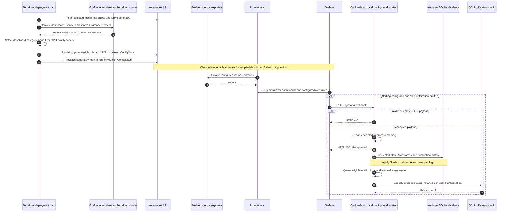

The webhook queues incoming alerts in memory and returns HTTP 200 once they're queued. Background workers track alert state in SQLite, apply debounce and reminder rules, and send eligible notifications to ONS. They skip `DatasourceNoData` alerts and log any publishing errors.

Sources: [operator monitoring deployments](../terraform/via-operator-helm-deployments.tf), [provider Prometheus deployment](../terraform/via-provider-kube-prometheus-stack.tf), [monitoring chart values](../terraform/files/kube-prometheus/values.yaml.tftpl), [provider Grafana ConfigMaps](../terraform/via-provider-grafana.tf), [operator Grafana ConfigMaps](../terraform/via-operator-grafana.tf), [Grafana notification policy](../terraform/files/grafana/alerts/alert-rules.yaml), [webhook implementation](../terraform/files/oke-ons-webhook/templates/configmap.yaml), [ONS topic](../terraform/topic.tf).

#### 8a. Grafonnet Dashboards - Source, Compilation and Deployment

Grafonnet lets us build dashboards from reusable pieces of Jsonnet code. A dashboard combines shared panel and variable helpers with its own queries, titles, units, thresholds, and layout. The renderer turns those definitions into the JSON Grafana loads from ConfigMaps. There are 21 dashboards here: seven for Kubernetes, five for GPUs, and nine for OCI metrics.

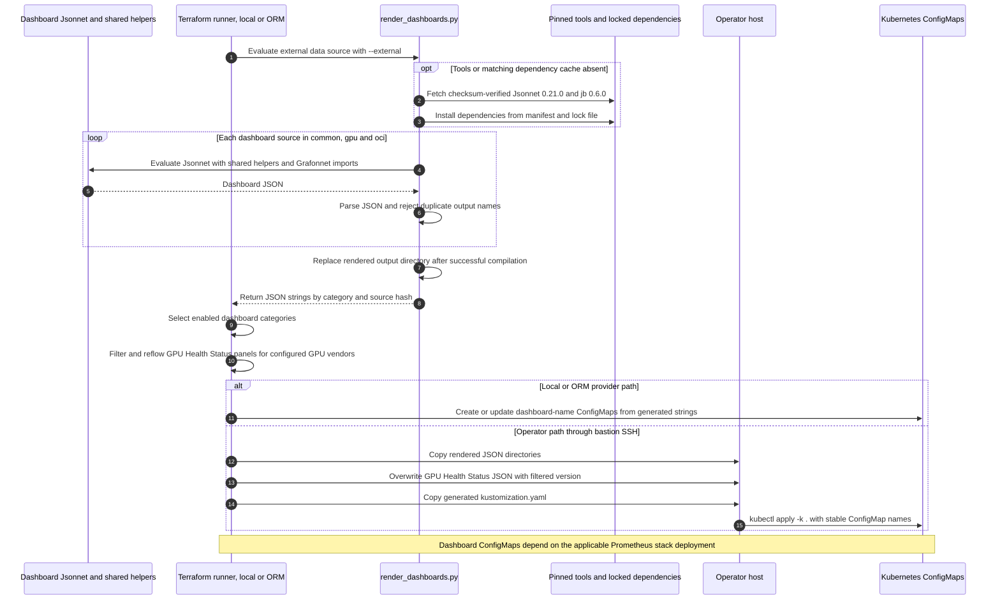

Terraform calls `render_dashboards.py` through an external data source, often during planning. Compilation happens on the Terraform runner, including when the dashboards will be deployed through the operator host. The renderer caches tools and dependencies under `.terraform/grafana-jsonnet` and rebuilds the dashboard JSON each time it runs.

Once all dashboards compile successfully, the renderer replaces the `rendered` directory and returns the JSON to Terraform. It also returns a hash of the sources, helpers, dependency manifests, and renderer. The operator deployment uses that hash to pick up source changes on the next apply.

Turning on `install_monitoring` and `install_grafana` enables the renderer. To publish the dashboards, the stack also needs `install_grafana_dashboards`, `install_node_problem_detector_kube_prometheus_stack`, and a supported deployment path. So the renderer can still run even when dashboard publication is turned off.

| Source category | Dashboard count | Folder annotation | Additional selection |
| --- | --- | --- | --- |
| `dashboards/common` | 7 | `Kubernetes` | Shared publication conditions above |
| `dashboards/gpu` | 5 | `GPU Nodes` | `has_amd_gpu || has_nvidia_gpu` |
| `dashboards/oci` | 9 | `OCI Metrics` | `setup_oci_metrics_exporter` |

Terraform adjusts GPU Health Status to match the configured GPUs: panel `7` is for NVIDIA and panel `23` is for AMD. It then arranges the remaining stat panels in rows of eight. Once the dashboard is loaded, Grafana queries the live metrics as shown in diagram 8b.

The older JSON files under `files/grafana/dashboards` are kept as a reference for development checks. Running `make verify` checks formatting, compiles the dashboards, and compares IDs, queries, variables, layout, and GPU vendor variants against that reference. Terraform deploys the freshly generated JSON.

Alert rules and the ONS contact point still live in YAML under `files/grafana/alerts`. They follow the alert ConfigMap path shown in diagram 8.

Sources: [Terraform renderer and vendor filtering](../terraform/grafana.tf), [renderer implementation](../terraform/files/grafana/jsonnet/render_dashboards.py), [Grafonnet import](../terraform/files/grafana/jsonnet/lib/g.libsonnet), [dependency manifest](../terraform/files/grafana/jsonnet/jsonnetfile.json), [dependency lock](../terraform/files/grafana/jsonnet/jsonnetfile.lock.json), [provider publication](../terraform/via-provider-grafana.tf), [operator publication and triggers](../terraform/via-operator-grafana.tf), [Makefile](../terraform/files/grafana/jsonnet/Makefile), [contract verifier](../terraform/files/grafana/jsonnet/verify_dashboards.py).

#### 8b. Grafana Dashboards - Provisioning and Live Metric Queries

Here's what happens once the generated GPU Metrics dashboard reaches the cluster. The Grafana sidecar picks up the dashboard ConfigMap, and Grafana uses its queries and variables to show metrics for the nodes you select.

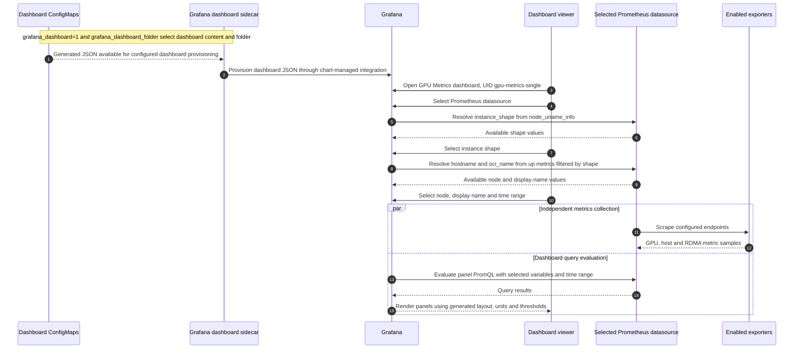

For example, `gpu-metrics.jsonnet` passes a title, query, legend, unit, position, and ID to `timeseries-panel.libsonnet`. The helper turns those into a time-series panel using the `$PROMETHEUS_DS` datasource. GPU temperature queries handle both AMD and NVIDIA metrics and normalize their labels where needed.

When you select a node in Grafana, the dashboard uses that selection in its Prometheus queries. When you edit a shared helper in the repository, every dashboard that imports it picks up the change on the next render and deployment.

Both deployment paths use the same ConfigMap names and folders. GPU Metrics lives in `dashboard-gpu-metrics`, under the key `gpu-metrics.json`, and keeps the dashboard UID `gpu-metrics-single`. The chart enables the dashboard sidecar, folder mapping, and UI edits.

You can try out changes in Grafana, then carry the ones you want to keep back into the Jsonnet source or shared helpers. That way, the next deployment includes them too.

Sources: [GPU Metrics source](../terraform/files/grafana/jsonnet/dashboards/gpu/gpu-metrics.jsonnet), [time-series panel helper](../terraform/files/grafana/jsonnet/lib/timeseries-panel.libsonnet), [GPU Metrics variables](../terraform/files/grafana/jsonnet/lib/gpu-metrics-variables.libsonnet), [sidecar configuration](../terraform/files/kube-prometheus/values.yaml.tftpl), [ConfigMap names and labels](../terraform/via-provider-grafana.tf). For operational procedures, see [Operating and developing Grafana dashboards](./grafonnet-dashboards.md).

### 9. Kueue Teardown - Drain Before Helm Removal

Before removing Kueue, Terraform runs a cleanup script through the operator or local/ORM runner. It removes Kueue resources across all namespaces and clears remaining finalizers so chart removal can proceed.

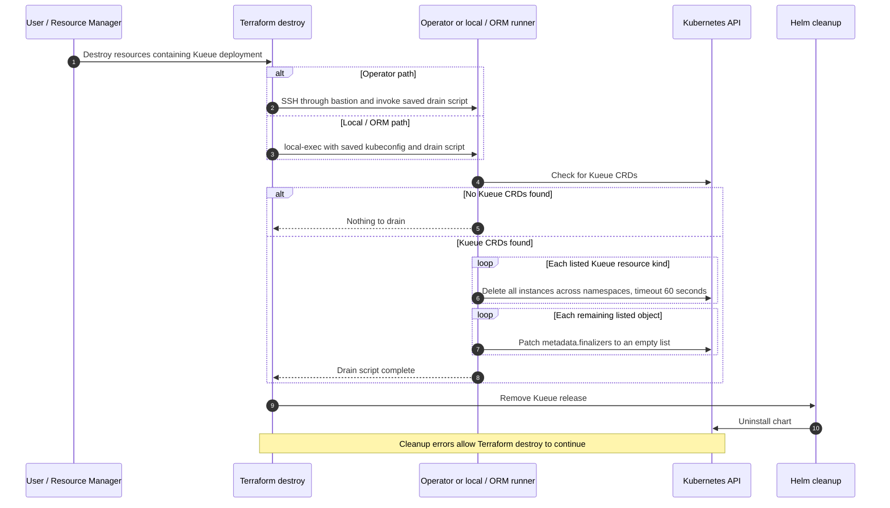

The operator helper runs `helm uninstall --wait`, while the local/ORM release uses `wait = false`. Both paths run the Kueue resource cleanup first and allow destroy to continue if cleanup encounters an error.

Sources: [operator drain resource](../terraform/via-operator-kueue-predestroy-drain.tf), [local/ORM drain resource](../terraform/via-orm-kueue-predestroy-drain.tf), [drain script](../terraform/files/kueue/predestroy-drain.sh), [operator Helm cleanup](../terraform/helm-module/helm-deployment.tf), [provider Kueue release](../terraform/via-provider-kueue.tf).

### 10. Optional Slinky Installation on OKE

Slinky adds Slurm to the OKE cluster using the same SSH/Helm helper as diagram 2. Its operator path is enabled by `install_slinky && create_bastion && create_operator && !deploy_to_oke_from_orm`. This also works with a public control plane when those settings are enabled.

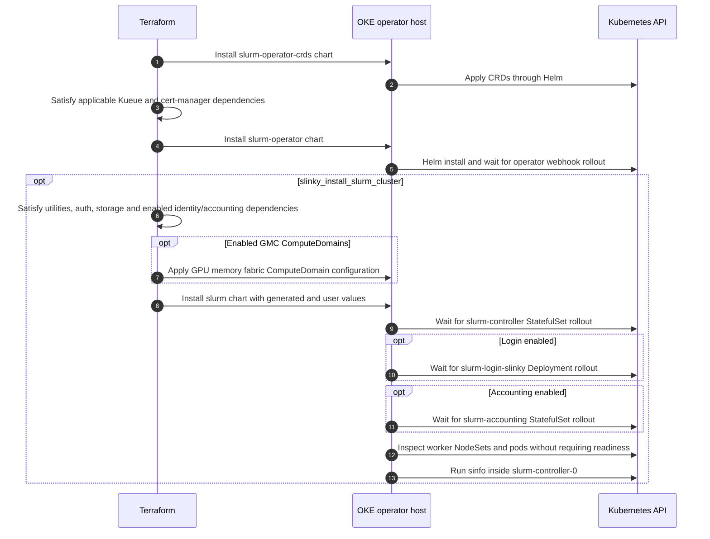

The Slurm chart install checks the controller, login, and accounting rollouts explicitly instead of using Helm `--wait`. It also prints worker NodeSet status, allowing workers to finish joining after the control plane is ready.

Sources: [Slinky selectors and generated values](../terraform/slinky.tf), [operator deployments and dependencies](../terraform/via-operator-slinky.tf), [Helm helper](../terraform/helm-module/helm-deployment.tf).

## Reading the Flows Together

Start with diagrams 1–4 to follow cluster creation, Kubernetes access, worker bootstrap, and storage setup. Diagrams 5–7 then show how nodes get their topology labels, how Kueue queues are set up, and how an MPI benchmark starts.

Diagram 8 brings monitoring together. The two details below it follow Grafonnet from source to deployed dashboard, then show how Grafana queries live metrics. Diagram 9 covers Kueue cleanup during destroy, and diagram 10 covers the optional Slinky setup.
