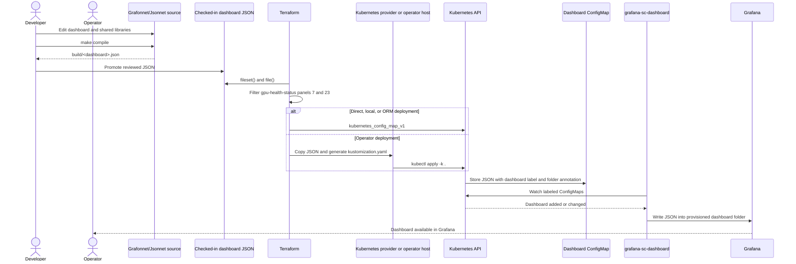

# Operating and developing Grafana dashboards

OKE stores dashboard source as Grafonnet/Jsonnet and deploys dashboards to
Grafana as JSON in Kubernetes ConfigMaps. This guide covers two workflows:

- an operator changing a dashboard in an already-running cluster; and
- a developer making a durable dashboard change for a future OKE deployment.

## Important deployment boundary

The current Kubernetes manifests do not compile Jsonnet. There is no Jsonnet
init container or Jsonnet compiler in the deployed monitoring stack.

`make compile` writes generated JSON to the ignored
`terraform/files/grafana/jsonnet/build` directory. Terraform continues to read
the checked-in JSON under `terraform/files/grafana/dashboards`. Therefore a
developer must copy a reviewed build artifact into the appropriate checked-in
dashboard directory before the change can be deployed by Terraform.

This boundary keeps compilers and source dependencies out of the cluster. It
also means that compiling Jsonnet by itself does not change a running cluster
or a subsequent Terraform deployment.

## What happens during OKE deployment



Terraform performs this flow only when monitoring, Grafana, dashboard
installation, and the kube-prometheus-stack deployment path are enabled. OCI
dashboards are additionally conditional on the OCI metrics exporter. GPU
ConfigMaps are created only when the configured cluster contains an AMD or
NVIDIA GPU.

### Components that make deployment work

| Component | Responsibility |
| --- | --- |
| `terraform/files/grafana/jsonnet` | Grafonnet/Jsonnet source, shared libraries, dependency lock, and local compiler commands. It is a build-time component, not a Kubernetes workload. |
| `terraform/files/grafana/dashboards/{common,gpu,oci}` | Reviewed JSON artifacts consumed by Terraform. |
| `terraform/grafana.tf` | Discovers dashboard JSON and prepares its content. It also filters and reflows `gpu-health-status.json` for the configured GPU vendor. |
| `terraform/via-provider-grafana.tf` | Creates dashboard ConfigMaps directly with the Kubernetes provider for direct, local, and ORM deployments. |
| `terraform/via-operator-grafana.tf` | Builds a Kustomize manifest, copies dashboard files to the operator host, and runs `kubectl apply -k .` for operator deployments. |
| `terraform/files/kube-prometheus/values.yaml.tftpl` | Enables the Grafana dashboard sidecar and configures `grafana_dashboard_folder` as its folder annotation. |
| Dashboard ConfigMap | Contains one JSON dashboard, the label `grafana_dashboard=1`, and a `grafana_dashboard_folder` annotation. |
| `grafana-sc-dashboard` | Watches matching ConfigMaps and makes their JSON available to Grafana. A ConfigMap update triggers a dashboard reload. |
| Grafana container | Provisions the JSON into the annotated Grafana folder. |

The kube-prometheus-stack values enable the watcher and tell it which annotation
contains the folder name:

```yaml
grafana:
  sidecar:
    dashboards:
      enabled: true
      folderAnnotation: grafana_dashboard_folder
      provider:
        allowUiUpdates: true
        disableDelete: false
        foldersFromFilesStructure: true
```

Both Terraform deployment paths ultimately create the equivalent of this
manifest. The name and JSON key change for each dashboard:

```yaml
apiVersion: v1
kind: ConfigMap
metadata:
  name: dashboard-gpu-metrics
  namespace: monitoring
  labels:
    grafana_dashboard: "1"
  annotations:
    grafana_dashboard_folder: GPU Nodes
data:
  gpu-metrics.json: |-
    { "uid": "...", "title": "...", "panels": [] }
```

For direct, local, and ORM deployments, the ConfigMap is a
`kubernetes_config_map_v1` resource and depends on the kube-prometheus-stack
Helm release. For operator deployments, Terraform waits for the monitoring
module, transfers the JSON and generated `kustomization.yaml` to the operator
host, and applies them with `kubectl apply -k .`. In both cases, the runtime
contract seen by the Grafana sidecar is the same ConfigMap label, annotation,
and JSON data.

The folder mappings created by Terraform are:

| Source directory | ConfigMap annotation |
| --- | --- |
| `dashboards/common` | `grafana_dashboard_folder=Kubernetes` |
| `dashboards/gpu` | `grafana_dashboard_folder=GPU Nodes` |
| `dashboards/oci` | `grafana_dashboard_folder=OCI Metrics` |

## Operator workflow on a running cluster

An operator can add or change a dashboard without reinstalling Grafana. The
sidecar watches ConfigMaps, so applying a correctly labeled ConfigMap is enough
to update the runtime dashboard.

Treat this as an operational override. A later Terraform apply will reconcile
the ConfigMap from the checked-in JSON and can replace the runtime change. A
change that must survive redeployment also needs the developer workflow below.

### Inspect the deployed dashboard source

Set the namespace used by the monitoring deployment and list the managed
dashboard ConfigMaps:

```bash
MONITORING_NAMESPACE=monitoring
kubectl get configmaps \
  --namespace "${MONITORING_NAMESPACE}" \
  --selector grafana_dashboard=1
```

Back up one dashboard before changing it. The ConfigMap is named
`dashboard-<dashboard-name>` and its data key is `<dashboard-name>.json`:

```bash
DASHBOARD_NAME=gpu-metrics
kubectl get configmap "dashboard-${DASHBOARD_NAME}" \
  --namespace "${MONITORING_NAMESPACE}" \
  --output json |
  jq -r --arg key "${DASHBOARD_NAME}.json" '.data[$key]' \
  > "/tmp/${DASHBOARD_NAME}.before.json"
```

### Compile and apply a panel or dashboard change

Compile the Jsonnet source on an operator workstation or development host. The
compiler is not run in the cluster:

```bash
make -C terraform/files/grafana/jsonnet bootstrap
make -C terraform/files/grafana/jsonnet fmt-check
make -C terraform/files/grafana/jsonnet compile
```

Apply one compiled GPU dashboard as a ConfigMap:

```bash
MONITORING_NAMESPACE=monitoring
DASHBOARD_NAME=gpu-metrics
DASHBOARD_FILE="terraform/files/grafana/jsonnet/build/${DASHBOARD_NAME}.json"
DASHBOARD_FOLDER="GPU Nodes"

kubectl create configmap "dashboard-${DASHBOARD_NAME}" \
  --namespace "${MONITORING_NAMESPACE}" \
  --from-file="${DASHBOARD_NAME}.json=${DASHBOARD_FILE}" \
  --dry-run=client --output yaml |
kubectl label --filename - --local --dry-run=client --output yaml \
  grafana_dashboard=1 |
kubectl annotate --filename - --local --dry-run=client --output yaml \
  "grafana_dashboard_folder=${DASHBOARD_FOLDER}" |
kubectl apply --filename -
```

Use `Kubernetes`, `GPU Nodes`, or `OCI Metrics` for the folder according to the
table above. Keep the dashboard UID unchanged when replacing a dashboard;
changing the UID creates a different Grafana dashboard instead of updating the
existing one.

Do not hot-apply the unfiltered `build/gpu-health-status.json` to a single-vendor
cluster. Terraform normally removes panel `7` for non-NVIDIA clusters, removes
panel `23` for non-AMD clusters, and reflows the remaining stat panels. Deploy
that dashboard through the normal Terraform path unless the operator has
deliberately reproduced the same vendor rendering.

### Verify the runtime update

Confirm that the ConfigMap contains the expected UID and that the sidecar saw
the update:

```bash
kubectl get configmap "dashboard-${DASHBOARD_NAME}" \
  --namespace "${MONITORING_NAMESPACE}" \
  --output json |
  jq -r --arg key "${DASHBOARD_NAME}.json" '.data[$key]' |
  jq '{uid, title, panelCount: (.panels | length)}'

kubectl logs \
  --namespace "${MONITORING_NAMESPACE}" \
  statefulset/kube-prometheus-stack-grafana \
  --container grafana-sc-dashboard \
  --tail 100
```

Open Grafana and verify the dashboard in its annotated folder. The deployment
outputs include the Grafana URL, credentials, and port-forward command where
applicable.

To roll back, apply the backed-up JSON with the same ConfigMap name, label, and
folder annotation. A normal Terraform apply also restores the repository-owned
version.

### Editing in the Grafana UI

The chart sets `allowUiUpdates: true`, so an operator may prototype a panel
change in Grafana. UI changes are not the durable source of truth and may be
overwritten when the sidecar reprovisions the ConfigMap. Export the prototype,
transfer its PromQL, layout, and styling into the Jsonnet source, and complete
the developer workflow for a permanent change.

## Developer workflow for durable changes

The Grafonnet package follows the Slurm composition model: dashboards are made
from Grafonnet constructors and focused `.libsonnet` helpers, while PromQL and
panel placement remain visible in each dashboard source.

### Package layout

```text
terraform/files/grafana/jsonnet/
├── dashboards/
│   ├── common/    # Kubernetes and monitoring dashboards
│   ├── gpu/       # GPU, host, health, and command-center dashboards
│   └── oci/       # OCI service dashboards
├── lib/           # Reusable panels, targets, variables, and Grafonnet import
├── build/         # Generated JSON; ignored by Git
├── vendor/        # Dependencies installed by jb; ignored by Git
├── jsonnetfile.json
├── jsonnetfile.lock.json
└── Makefile
```

Every dashboard filename must be unique across the three source directories
because compilation writes outputs by basename.

### Add a dashboard or panel

1. Add or edit the `.jsonnet` source in `dashboards/common`, `dashboards/gpu`,
   or `dashboards/oci`.
2. Construct dashboards, variables, and panels with Grafonnet. Reuse focused
   helpers from `lib`; add a shared helper when multiple dashboards need the
   same behavior.
3. Keep PromQL, units, legends, and `{ w, h, x, y }` positions visible at the
   dashboard call site.
4. Preserve dashboard UID and existing panel IDs. In particular,
   `gpu-health-status` panel IDs `7` and `23` are part of Terraform's vendor
   filtering and reflow contract.
5. Compile all dashboards after changing a shared library.

A panel normally looks like this at its call site:

```jsonnet
local g = import '../../lib/g.libsonnet';
local timeseriesPanel = import '../../lib/timeseries-panel.libsonnet';

g.dashboard.new('Example Metrics')
+ g.dashboard.withUid('example-metrics')
+ g.dashboard.withPanels([
  timeseriesPanel(
    'Request Rate',
    'sum(rate(example_requests_total[5m]))',
    '{{ instance }}',
    'reqps',
    { w: 12, h: 8, x: 0, y: 0 },
    id=1,
  ),
], setPanelIDs=false)
```

Avoid embedding a complete Grafana export as a raw Jsonnet object. Raw object
additions should be limited to behavior that the pinned Grafonnet library does
not expose.

### Build and validate

Install the pinned dependency once, then format and compile:

```bash
make -C terraform/files/grafana/jsonnet bootstrap
make -C terraform/files/grafana/jsonnet fmt
make -C terraform/files/grafana/jsonnet fmt-check
make -C terraform/files/grafana/jsonnet compile
```

Compilation proves that the Grafonnet objects evaluate; it does not prove that
PromQL returns data in a cluster. Inspect the generated dashboard's UID, title,
panel IDs, targets, variables, links, datasource UIDs, units, and grid
positions. Test PromQL against a representative Prometheus datasource and use
an isolated Grafana instance for visual changes.

### Promote JSON into the deployment input

After reviewing the build artifact, copy it into the category consumed by
Terraform:

```bash
cp terraform/files/grafana/jsonnet/build/gpu-metrics.json \
  terraform/files/grafana/dashboards/gpu/gpu-metrics.json
```

Use `dashboards/common`, `dashboards/gpu`, or `dashboards/oci` consistently with
the source category. A new JSON filename is automatically discovered by
Terraform's `fileset`; no per-dashboard Terraform resource is required.

Review both the Jsonnet source diff and the generated JSON diff. Commit the
source, shared libraries, and promoted deployment JSON together. Do not commit
`build` or `vendor`.

Run the repository's relevant Terraform formatting, validation, and plan checks
before deployment. The subsequent Terraform apply creates or updates the
ConfigMap, and the existing Grafana sidecar performs the runtime reload shown in
the deployment sequence above.

## Choosing the right workflow

| Need | Action | Persistence |
| --- | --- | --- |
| Inspect what is running | Read the labeled ConfigMap and sidecar logs. | Read-only |
| Test an urgent panel adjustment | Compile JSON and update one dashboard ConfigMap. | Temporary; Terraform can overwrite it |
| Prototype visually | Edit in Grafana, then export the result. | Temporary; ConfigMap provisioning can overwrite it |
| Add or change a shipped dashboard | Update Grafonnet, compile, promote JSON, validate, and deploy through Terraform. | Durable and reproducible |
| Change `gpu-health-status` | Preserve IDs `7` and `23` and use Terraform's vendor-aware deployment path. | Durable and vendor-correct |
