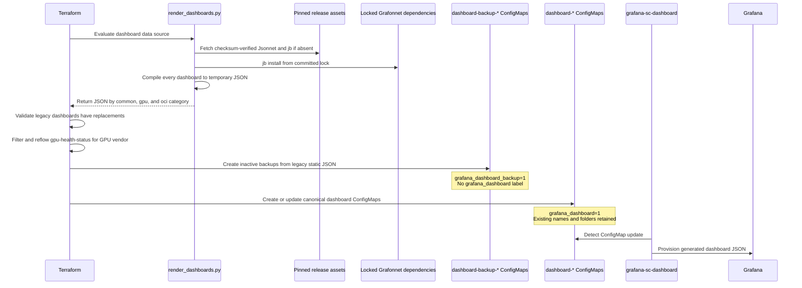

# Operating and developing Grafana dashboards

OKE dashboard source is maintained as Grafonnet/Jsonnet under
`terraform/files/grafana/jsonnet`. Terraform compiles that source automatically
during deployment and puts the generated JSON into Kubernetes ConfigMaps.
Generated JSON is temporary and must not be committed.

The previous static dashboards are retained temporarily as inactive backup
ConfigMaps. They are rollback data only and will be removed after the dashboard
conversion has been proven across the agreed transition releases.

## Deployment sequence



Compilation runs in the Terraform execution environment, including OCI Resource
Manager when the stack is deployed there. It does not run in the Grafana pod,
and no Jsonnet init container is required.

The renderer pins and checksum-verifies Jsonnet and jsonnet-bundler. Grafonnet
and its transitive libraries remain pinned by `jsonnetfile.lock.json`. Tools,
dependencies, and generated JSON are cached below `.terraform/grafana-jsonnet`
for a Terraform deployment and are not repository artifacts.

The Terraform execution environment requires Python 3 and outbound HTTPS access
to GitHub for an uncached tool or dependency installation. Developers also need
`make` for the local convenience targets.

If tool installation, dependency installation, Jsonnet evaluation, JSON
parsing, or dashboard-set validation fails, Terraform stops before changing an
active dashboard ConfigMap.

## Components involved

| Component | Deployment responsibility |
| --- | --- |
| `terraform/files/grafana/jsonnet/dashboards` | Sole active dashboard source, organized into `common`, `gpu`, and `oci`. |
| `terraform/files/grafana/jsonnet/lib` | Shared Grafonnet panel, target, variable, threshold, and layout helpers. |
| `render_dashboards.py` | Installs pinned tools and dependencies, compiles all dashboards, validates JSON, and returns the generated content to Terraform. |
| `jsonnetfile.json` and `jsonnetfile.lock.json` | Pin Grafonnet and transitive Jsonnet dependencies. |
| `terraform/grafana.tf` | Invokes the renderer, validates replacement coverage, and performs GPU vendor filtering and panel reflow. |
| `terraform/via-provider-grafana.tf` | Creates backup ConfigMaps first and active ConfigMaps second for local and ORM deployments. |
| `terraform/via-operator-grafana.tf` | Creates backup ConfigMaps, transfers generated JSON to the operator host, and applies the active Kustomize manifest. |
| `terraform/files/kube-prometheus/values.yaml.tftpl` | Enables the Grafana dashboard sidecar and its folder annotation. |
| `terraform/files/grafana/legacy-dashboard-backups` | Temporary, immutable legacy JSON used only for rollback ConfigMaps. |

The Grafana chart enables this existing sidecar behavior:

```yaml
grafana:
  sidecar:
    dashboards:
      enabled: true
      folderAnnotation: grafana_dashboard_folder
      provider:
        allowUiUpdates: true
        disableDelete: false
        foldersFromFilesStructure: true
```

## Active and backup ConfigMaps

Each converted dashboard has two ConfigMaps during the transition:

| Purpose | Example name | Label | Sidecar behavior |
| --- | --- | --- | --- |
| Active generated dashboard | `dashboard-gpu-metrics` | `grafana_dashboard=1` | Loaded by Grafana |
| Legacy rollback copy | `dashboard-backup-gpu-metrics` | `grafana_dashboard_backup=1` | Ignored by Grafana |

The active ConfigMap retains the pre-conversion name, JSON data key, dashboard
UID, and folder annotation. Only its JSON data changes from checked-in static
JSON to deployment-generated Jsonnet output.

Backup ConfigMaps intentionally do not have `grafana_dashboard=1`. Loading both
copies would expose the same dashboard UID twice and make provisioning order
ambiguous.

Folder annotations remain:

| Jsonnet category | Grafana folder |
| --- | --- |
| `dashboards/common` | `Kubernetes` |
| `dashboards/gpu` | `GPU Nodes` |
| `dashboards/oci` | `OCI Metrics` |

OCI dashboards are deployed only when the OCI metrics exporter is enabled. GPU
dashboards are deployed only when the cluster contains an AMD or NVIDIA GPU.

### Provider deployment path

For local and OCI Resource Manager deployments, Terraform:

1. Compiles Jsonnet through the external data source.
2. Creates `kubernetes_config_map_v1` backup resources from legacy JSON.
3. Waits for backup creation.
4. Updates the existing `kubernetes_config_map_v1` active resources with the
   generated content.

### Operator deployment path

For private-control-plane deployments through the operator host, Terraform:

1. Compiles Jsonnet on the Terraform execution host.
2. Applies a backup-only Kustomization on the operator host.
3. Transfers the temporary generated JSON to the operator host.
4. Overwrites the generated `gpu-health-status.json` with Terraform's
   vendor-filtered and reflowed rendering.
5. Applies the active dashboards and alerts with `kubectl apply -k .`.

Both deployment paths produce the same active and backup ConfigMap contracts.

## Operator workflow after deployment

### Verify active and backup dashboards

```bash
MONITORING_NAMESPACE=monitoring

kubectl get configmaps \
  --namespace "${MONITORING_NAMESPACE}" \
  --selector grafana_dashboard=1

kubectl get configmaps \
  --namespace "${MONITORING_NAMESPACE}" \
  --selector grafana_dashboard_backup=1
```

Confirm that a backup is not visible to the sidecar:

```bash
kubectl get configmap dashboard-backup-gpu-metrics \
  --namespace "${MONITORING_NAMESPACE}" \
  --output jsonpath='{.metadata.labels}'
```

The result must contain `grafana_dashboard_backup: 1` and must not contain
`grafana_dashboard: 1`.

Inspect the active dashboard identity:

```bash
kubectl get configmap dashboard-gpu-metrics \
  --namespace "${MONITORING_NAMESPACE}" \
  --output json |
jq -r '.data["gpu-metrics.json"]' |
jq '{uid, title, panelCount: (.panels | length)}'
```

Confirm that the sidecar processed the update:

```bash
kubectl logs \
  --namespace "${MONITORING_NAMESPACE}" \
  statefulset/kube-prometheus-stack-grafana \
  --container grafana-sc-dashboard \
  --tail 100
```

### Change a dashboard in the runtime system

The durable operational path is to update the Jsonnet source and run the normal
Terraform deployment. Terraform recompiles all dashboards and updates only
ConfigMaps whose generated content changed.

For an emergency experiment, an operator may compile locally and apply one
generated JSON file to the canonical ConfigMap. Generated paths preserve the
category:

```bash
make -C terraform/files/grafana/jsonnet compile

DASHBOARD_NAME=gpu-metrics
DASHBOARD_FILE="terraform/files/grafana/jsonnet/build/gpu/${DASHBOARD_NAME}.json"
DASHBOARD_FOLDER="GPU Nodes"

kubectl create configmap "dashboard-${DASHBOARD_NAME}" \
  --namespace "${MONITORING_NAMESPACE}" \
  --from-file="${DASHBOARD_NAME}.json=${DASHBOARD_FILE}" \
  --dry-run=client --output yaml |
kubectl label --filename - --local --dry-run=client --output yaml \
  grafana_dashboard=1 |
kubectl annotate --filename - --local --dry-run=client --output yaml \
  "grafana_dashboard_folder=${DASHBOARD_FOLDER}" |
kubectl apply --filename -
```

This is temporary: the next Terraform apply restores the content compiled from
the committed Jsonnet source. Do not hot-apply raw `gpu-health-status.json` to a
single-vendor cluster because Terraform normally performs vendor filtering and
reflow.

### Restore one legacy backup temporarily

Copy the backup data into the canonical active ConfigMap. Do not add the active
sidecar label to the backup ConfigMap itself.

```bash
DASHBOARD_NAME=gpu-metrics
BACKUP_FILE="/tmp/${DASHBOARD_NAME}-legacy.json"

kubectl get configmap "dashboard-backup-${DASHBOARD_NAME}" \
  --namespace "${MONITORING_NAMESPACE}" \
  --output json |
jq -r --arg key "${DASHBOARD_NAME}.json" '.data[$key]' \
  > "${BACKUP_FILE}"

kubectl create configmap "dashboard-${DASHBOARD_NAME}" \
  --namespace "${MONITORING_NAMESPACE}" \
  --from-file="${DASHBOARD_NAME}.json=${BACKUP_FILE}" \
  --dry-run=client --output yaml |
kubectl label --filename - --local --dry-run=client --output yaml \
  grafana_dashboard=1 |
kubectl annotate --filename - --local --dry-run=client --output yaml \
  "grafana_dashboard_folder=GPU Nodes" |
kubectl apply --filename -
```

This rollback is also temporary. The next Terraform apply returns the active
ConfigMap to generated Jsonnet output. Use the previous OKE release for a
release-level rollback.

### Grafana UI edits

`allowUiUpdates` permits UI experiments, but ConfigMap provisioning remains the
source of truth. Export a useful prototype and transfer its PromQL, layout,
targets, variables, links, and styling into Jsonnet. A later sidecar update can
replace UI-only changes.

## Developer workflow

### Package layout

```text
terraform/files/grafana/jsonnet/
├── dashboards/
│   ├── common/
│   ├── gpu/
│   └── oci/
├── lib/
├── build/                 # Local generated JSON; ignored
├── .cache/                # Pinned tools and dependencies; ignored
├── jsonnetfile.json
├── jsonnetfile.lock.json
├── render_dashboards.py
├── verify_dashboards.py
└── Makefile
```

### Add a dashboard or panel

1. Add or edit a `.jsonnet` file in the appropriate category.
2. Build it with Grafonnet constructors and focused `.libsonnet` helpers.
3. Keep PromQL, units, legends, and `{ w, h, x, y }` placement visible at the
   dashboard call site.
4. Preserve UIDs and existing panel IDs when changing a dashboard.
5. Preserve query mode as well as PromQL. Instant stat queries and range time
   series queries are not interchangeable.
6. Reuse a shared helper when behavior is common across dashboards.
7. Do not add generated JSON or a new legacy backup for a new dashboard.

`gpu-health-status` must retain panel IDs `7` and `23`. Terraform uses those IDs
to select NVIDIA and AMD panels respectively and then reflows the remaining stat
panels.

### Format, compile, and verify

```bash
make -C terraform/files/grafana/jsonnet fmt
make -C terraform/files/grafana/jsonnet verify
```

`make verify` checks formatting, compiles all dashboards, compares the converted
dashboards with their transition backups, and tests AMD-only, NVIDIA-only, and
mixed GPU-health behavior.

To test the package from an isolated directory with a clean dependency install:

```bash
make -C terraform/files/grafana/jsonnet package-test
```

Generated JSON appears under category-preserving paths such as:

```text
terraform/files/grafana/jsonnet/build/gpu/gpu-metrics.json
```

Use it for review or isolated Grafana testing only. Do not copy it into another
repository directory and do not commit it. Terraform calls the same renderer
automatically during deployment.

Before review, also run focused Terraform formatting and validation. Compilation
proves that the Jsonnet evaluates; representative-cluster testing is still
required to prove that PromQL returns the expected data and that Grafana renders
the intended visual behavior.

## Removing the transition backups

After the converted dashboards have been validated across the agreed releases,
a separate cleanup change should:

1. Remove `terraform/files/grafana/legacy-dashboard-backups`.
2. Remove the provider backup ConfigMap resources.
3. Remove the operator backup Kustomization and transfer steps.
4. Delete `dashboard-backup-*` ConfigMaps during the upgrade.
5. Remove the backup verification and rollback sections from this guide.

The active `dashboard-*` ConfigMap names and Jsonnet deployment path do not need
to change during that cleanup.
