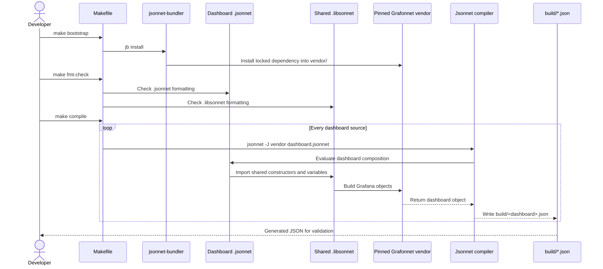

# Developing Grafana dashboards with Grafonnet

The Grafonnet package under `terraform/files/grafana/jsonnet` provides
source-controlled Jsonnet definitions for the Grafana dashboards shipped with
OKE. It uses the same composition model as the Slurm dashboards: a dashboard
is assembled from Grafonnet constructors and small reusable `.libsonnet`
helpers, while PromQL and panel layout remain visible in the dashboard source.

The package currently compiles dashboards into an isolated, ignored `build`
directory. It does not overwrite the checked-in dashboard JSON under
`terraform/files/grafana/dashboards` or change the Terraform deployment path.

## Compilation sequence



The Grafonnet revision is pinned by `jsonnetfile.json` and
`jsonnetfile.lock.json`. The `vendor` and `build` directories are intentionally
ignored by Git.

## Prerequisites

Install these commands and make sure they are available on `PATH`:

- `jsonnet`
- `jsonnetfmt`
- `jb` from jsonnet-bundler
- `make`

From the repository root, install the pinned dependencies once:

```bash
make -C terraform/files/grafana/jsonnet bootstrap
```

## Package layout

```text
terraform/files/grafana/jsonnet/
├── dashboards/
│   ├── common/    # Kubernetes and monitoring dashboards
│   ├── gpu/       # GPU, host, health, and command-center dashboards
│   └── oci/       # OCI service dashboards
├── lib/           # Reusable panels, targets, variables, and Grafonnet import
├── build/         # Generated JSON; ignored by Git
├── vendor/        # Dependencies installed by jb; ignored by Git
├── jsonnetfile.json
├── jsonnetfile.lock.json
└── Makefile
```

Every dashboard filename must be unique across all three dashboard directories.
The compiler writes outputs using only the basename, for example
`dashboards/gpu/gpu-metrics.jsonnet` becomes `build/gpu-metrics.json`.

## Add a dashboard

1. Select the appropriate directory under `dashboards`.
1. Create `<dashboard-name>.jsonnet`. Start with the shared Grafonnet import and
   reuse existing panel and variable helpers when their behavior matches the
   new dashboard.
1. Set the dashboard title and stable UID with `g.dashboard.new()` and
   `g.dashboard.withUid()`.
1. Add variables with Grafonnet variable constructors. Put variables reused by
   the dashboard in a focused `.libsonnet` file under `lib`.
1. Add panels through the existing shared constructors. Keep each panel's
   PromQL, unit, legend, and `{ w, h, x, y }` position visible at the call site.
1. Assign explicit panel IDs when an existing dashboard or Terraform behavior
   depends on them. Finish the panel list with `setPanelIDs=false` when IDs are
   supplied by the source.
1. Compile and inspect the generated JSON before committing.

A dashboard follows this general form:

```jsonnet
local g = import '../../lib/g.libsonnet';
local timeseriesPanel = import '../../lib/timeseries-panel.libsonnet';

g.dashboard.new('Example Metrics')
+ g.dashboard.withUid('example-metrics')
+ g.dashboard.withTimezone('browser')
+ g.dashboard.time.withFrom('now-5m')
+ g.dashboard.withPanels([
  timeseriesPanel(
    'Request Rate',
    'sum(rate(example_requests_total[5m]))',
    '{{ instance }}',
    'reqps',
    { w: 12, h: 8, x: 0, y: 0 },
    id=1,
  ),
], setPanelIDs=false)
```

Do not copy an entire exported Grafana dashboard into a Jsonnet object. Use
Grafonnet constructors and extract reusable behavior into `.libsonnet` files.
Raw object additions should be limited to Grafana behavior that Grafonnet does
not expose, such as a specialized transformation or uncommon panel option.

## Add or change a panel

For an existing dashboard:

1. Open its `.jsonnet` source under `dashboards`.
1. Reuse the closest shared panel constructor from `lib`.
1. Keep the PromQL and grid position in the dashboard source. Preserve an
   existing panel ID when modifying or replacing a panel.
1. If several dashboards need the same behavior, update or add a narrowly
   scoped helper instead of duplicating the panel construction.
1. If a change affects a shared helper, compile all dashboards because every
   importing dashboard can change.

The GPU health dashboard has an additional compatibility requirement: panel
IDs `7` and `23` must remain unchanged because Terraform uses them for GPU
vendor filtering and panel reflow.

## Format and compile

Run these commands from the repository root:

```bash
# Format Jsonnet sources in place.
make -C terraform/files/grafana/jsonnet fmt

# Verify formatting without modifying files.
make -C terraform/files/grafana/jsonnet fmt-check

# Compile every dashboard into terraform/files/grafana/jsonnet/build/.
make -C terraform/files/grafana/jsonnet compile
```

To compile one dashboard while iterating:

```bash
jsonnet \
  -J terraform/files/grafana/jsonnet/vendor \
  --output-file /tmp/gpu-metrics.json \
  terraform/files/grafana/jsonnet/dashboards/gpu/gpu-metrics.jsonnet
```

Clean all generated package outputs with:

```bash
make -C terraform/files/grafana/jsonnet clean
```

## Validate generated dashboards

Compilation proves that the Jsonnet and Grafonnet objects evaluate successfully;
it does not prove that PromQL returns data in a running cluster. Before review:

1. Confirm the generated dashboard has the intended title and UID.
1. Compare panel IDs, titles, grid positions, targets, units, variables, links,
   and datasource UIDs with the dashboard being replaced.
1. Import the generated JSON into an isolated Grafana instance when changing
   panel styling, transformations, mappings, or links.
1. Test PromQL against a representative Prometheus datasource.
1. Run `git diff --check` and confirm that `build` and `vendor` remain untracked.

Grafana exports many default fields that Grafonnet intentionally omits. Review
behavioral differences rather than requiring byte-for-byte equality when an
omitted field is a Grafana default.
