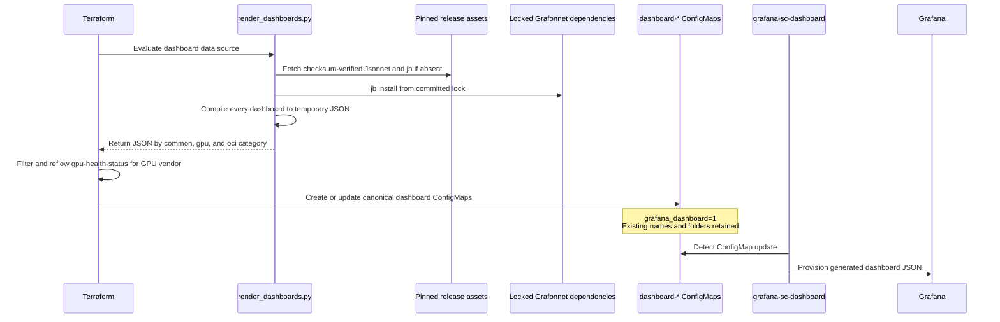

# Operating and developing Grafana dashboards

OKE dashboard source is maintained as Grafonnet/Jsonnet under
`terraform/files/grafana/jsonnet`. Terraform compiles that source automatically
during deployment and puts the generated JSON into Kubernetes ConfigMaps.
Generated JSON is temporary and must not be committed.

The previous static dashboard JSON remains unchanged under
`terraform/files/grafana/dashboards` as a repository reference. Terraform does
not read, copy, or deploy those files.

## Deployment sequence



Compilation runs in the Terraform execution environment, including OCI Resource
Manager when the stack is deployed there. It does not run in the Grafana pod,
and no Jsonnet init container is required.

The renderer pins and checksum-verifies Jsonnet and jsonnet-bundler. Grafonnet
and its transitive libraries remain pinned by `jsonnetfile.lock.json`. Tools,
dependencies, and generated JSON are cached below `.terraform/grafana-jsonnet`
for a Terraform deployment and are not repository artifacts.

The Terraform execution environment requires Python 3 and outbound HTTPS access
to GitHub for an uncached tool or dependency installation. Developers also need
`make` for the local convenience targets.

If tool installation, dependency installation, Jsonnet evaluation, or JSON
parsing fails, Terraform stops before changing an active dashboard ConfigMap.

## Components involved

| Component | Deployment responsibility |
| --- | --- |
| `terraform/files/grafana/jsonnet/dashboards` | Sole active dashboard source, organized into `common`, `gpu`, and `oci`. |
| `terraform/files/grafana/jsonnet/lib` | Shared Grafonnet panel, target, variable, threshold, and layout helpers. |
| `render_dashboards.py` | Installs pinned tools and dependencies, compiles all dashboards, validates JSON, and returns the generated content to Terraform. |
| `jsonnetfile.json` and `jsonnetfile.lock.json` | Pin Grafonnet and transitive Jsonnet dependencies. |
| `terraform/grafana.tf` | Invokes the renderer and performs GPU vendor filtering and panel reflow. |
| `terraform/via-provider-grafana.tf` | Creates active ConfigMaps from generated JSON for local and ORM deployments. |
| `terraform/via-operator-grafana.tf` | Transfers generated JSON to the operator host and applies the active Kustomize manifest. |
| `terraform/files/kube-prometheus/values.yaml.tftpl` | Enables the Grafana dashboard sidecar and its folder annotation. |
| `terraform/files/grafana/dashboards` | Unchanged static JSON retained only as a repository comparison reference; it is not a deployment input. |

The Grafana chart enables this existing sidecar behavior:

```yaml
grafana:
  sidecar:
    dashboards:
      enabled: true
      folderAnnotation: grafana_dashboard_folder
      provider:
        allowUiUpdates: true
        disableDelete: false
        foldersFromFilesStructure: true
```

## Active ConfigMaps

The active ConfigMap retains the pre-conversion name, JSON data key, dashboard
UID, and folder annotation. Only its JSON data changes from checked-in static
JSON to deployment-generated Jsonnet output.

For example, `dashboard-gpu-metrics` retains the label
`grafana_dashboard=1` and is loaded by the Grafana sidecar.

Folder annotations remain:

| Jsonnet category | Grafana folder |
| --- | --- |
| `dashboards/common` | `Kubernetes` |
| `dashboards/gpu` | `GPU Nodes` |
| `dashboards/oci` | `OCI Metrics` |

OCI dashboards are deployed only when the OCI metrics exporter is enabled. GPU
dashboards are deployed only when the cluster contains an AMD or NVIDIA GPU.

### Provider deployment path

For local and OCI Resource Manager deployments, Terraform:

1. Compiles Jsonnet through the external data source.
2. Updates the existing `kubernetes_config_map_v1` active resources with the
   generated content.

### Operator deployment path

For private-control-plane deployments through the operator host, Terraform:

1. Compiles Jsonnet on the Terraform execution host.
2. Transfers the temporary generated JSON to the operator host.
3. Overwrites the generated `gpu-health-status.json` with Terraform's
   vendor-filtered and reflowed rendering.
4. Applies the active dashboards and alerts with `kubectl apply -k .`.

Both deployment paths produce the same active ConfigMap contract.

## Update a running cluster without Terraform

A dashboard-only update does not require `terraform apply`. Compile the changed
dashboard on a workstation, patch only the JSON value in its existing
ConfigMap, and let the Grafana sidecar reprovision it. Patching `.data` preserves
the ConfigMap name, `grafana_dashboard=1` label, folder annotation, and all
other metadata managed by the deployment.

This is the preferred way to validate a dashboard change in a running cluster
before scheduling a durable stack update. It changes no cluster infrastructure.

### Verify active dashboards

```bash
MONITORING_NAMESPACE=monitoring

kubectl get configmaps \
  --namespace "${MONITORING_NAMESPACE}" \
  --selector grafana_dashboard=1
```

Inspect the active dashboard identity:

```bash
kubectl get configmap dashboard-gpu-metrics \
  --namespace "${MONITORING_NAMESPACE}" \
  --output json |
jq -r '.data["gpu-metrics.json"]' |
jq '{uid, title, panelCount: (.panels | length)}'
```

Confirm that the sidecar processed the update:

```bash
kubectl logs \
  --namespace "${MONITORING_NAMESPACE}" \
  statefulset/kube-prometheus-stack-grafana \
  --container grafana-sc-dashboard \
  --tail 100
```

### Patch one dashboard

Compile and verify the source first. This example updates GPU Metrics:

```bash
make -C terraform/files/grafana/jsonnet verify

MONITORING_NAMESPACE=monitoring
DASHBOARD_NAME=gpu-metrics
DASHBOARD_FILE="terraform/files/grafana/jsonnet/build/gpu/${DASHBOARD_NAME}.json"
CONFIGMAP_NAME="dashboard-${DASHBOARD_NAME}"
CURRENT_DASHBOARD="/tmp/${DASHBOARD_NAME}-before.json"
PATCH_FILE="$(mktemp)"

# Keep the currently deployed JSON locally for immediate rollback.
kubectl get configmap "${CONFIGMAP_NAME}" \
  --namespace "${MONITORING_NAMESPACE}" \
  --output json |
jq -r --arg key "${DASHBOARD_NAME}.json" '.data[$key]' \
  > "${CURRENT_DASHBOARD}"

# Change only the ConfigMap data entry. Existing labels and annotations remain.
jq --null-input \
  --arg key "${DASHBOARD_NAME}.json" \
  --rawfile dashboard "${DASHBOARD_FILE}" \
  '{data: {($key): $dashboard}}' \
  > "${PATCH_FILE}"

kubectl patch configmap "${CONFIGMAP_NAME}" \
  --namespace "${MONITORING_NAMESPACE}" \
  --type merge \
  --patch-file "${PATCH_FILE}"

rm -f "${PATCH_FILE}"
```

The dashboard sidecar watches ConfigMaps with `grafana_dashboard=1`, writes the
updated file into the Grafana provisioning directory, and causes Grafana to
reload it. A Grafana pod restart is normally unnecessary.

Do not patch the raw `gpu-health-status.json` build artifact into a
single-vendor cluster. Terraform normally filters panel ID `7` for NVIDIA and
panel ID `23` for AMD and then reflows the remaining stat panels. Use the
vendor-aware rendering procedure in
`docs/deploying-monitoring-stack-manually.md`, Step 5.2, for that dashboard.

### Verify the runtime update

Confirm the ConfigMap contains the expected dashboard identity:

```bash
kubectl get configmap "${CONFIGMAP_NAME}" \
  --namespace "${MONITORING_NAMESPACE}" \
  --output json |
jq -r --arg key "${DASHBOARD_NAME}.json" '.data[$key]' |
jq '{uid, title, panelCount: (.panels | length)}'
```

Then inspect the sidecar log and Grafana UI:

```bash
kubectl logs \
  --namespace "${MONITORING_NAMESPACE}" \
  statefulset/kube-prometheus-stack-grafana \
  --container grafana-sc-dashboard \
  --since 5m
```

If the ConfigMap is correct but the sidecar does not process it, inspect the
sidecar logs and labels first. Restart Grafana only as a recovery step:

```bash
kubectl rollout restart \
  statefulset/kube-prometheus-stack-grafana \
  --namespace "${MONITORING_NAMESPACE}"

kubectl rollout status \
  statefulset/kube-prometheus-stack-grafana \
  --namespace "${MONITORING_NAMESPACE}"
```

### Roll back the runtime update

Patch the saved JSON back into the same ConfigMap:

```bash
PATCH_FILE="$(mktemp)"
jq --null-input \
  --arg key "${DASHBOARD_NAME}.json" \
  --rawfile dashboard "${CURRENT_DASHBOARD}" \
  '{data: {($key): $dashboard}}' \
  > "${PATCH_FILE}"

kubectl patch configmap "${CONFIGMAP_NAME}" \
  --namespace "${MONITORING_NAMESPACE}" \
  --type merge \
  --patch-file "${PATCH_FILE}"

rm -f "${PATCH_FILE}"
```

### Make the change durable

A direct ConfigMap patch is intentionally a runtime override. It remains until
another process changes or recreates that ConfigMap. The next Terraform apply
will restore the JSON compiled from the Terraform configuration being applied.

After runtime validation:

1. Commit the Jsonnet change to source control and complete code review.
2. Include it in the OKE release or Terraform configuration used by the stack.
3. For an OCI Resource Manager stack, upload the updated Terraform
   configuration, review a plan, and apply it during the normal maintenance
   process.
4. For a locally managed stack, use the updated checkout, review
   `terraform plan`, and run `terraform apply` during the normal maintenance
   process.

There is no agent in the running cluster that pulls Jsonnet from GitHub. The
ConfigMap patch is the low-risk validation path; the reviewed stack update is
the durable deployment path.

### Grafana UI edits

`allowUiUpdates` permits UI experiments, but ConfigMap provisioning remains the
source of truth. Export a useful prototype and transfer its PromQL, layout,
targets, variables, links, and styling into Jsonnet. A later sidecar update can
replace UI-only changes.

## Developer workflow

### Download the current released source

For a change intended for an existing cluster, start with the release recorded
by that stack's `stack_version` output. Using a newer release may introduce
unrelated differences. For development against the latest published release,
the GitHub CLI can discover its tag. Set `RELEASE_TAG` using one of these paths:

```bash
# Existing locally managed stack
RELEASE_TAG="$(terraform -chdir=terraform output -raw stack_version)"

# Or, for development against the latest published release
RELEASE_TAG="$(gh release view \
  --repo oracle-quickstart/oci-hpc-oke \
  --json tagName \
  --jq '.tagName')"
```

For OCI Resource Manager, obtain `stack_version` from the existing stack's
outputs. Then download that release's source archive, extract it into a new
directory, and enter the directory:

```bash
REPOSITORY="oracle-quickstart/oci-hpc-oke"
SOURCE_DIR="oci-hpc-oke-${RELEASE_TAG}-source"
SOURCE_ARCHIVE="${SOURCE_DIR}.tar.gz"

gh release download "${RELEASE_TAG}" \
  --repo "${REPOSITORY}" \
  --archive tar.gz \
  --output "${SOURCE_ARCHIVE}"

mkdir "${SOURCE_DIR}"
tar --extract \
  --gzip \
  --file "${SOURCE_ARCHIVE}" \
  --directory "${SOURCE_DIR}" \
  --strip-components 1

cd "${SOURCE_DIR}"
```

GitHub also provides a **Source code (zip)** archive on each release page. If
using the zip, extract it with the operating system's archive tool and enter the
single `oci-hpc-oke-*` directory it creates.

A release archive has no `.git` history. It is sufficient for compiling and
testing a runtime change. For a contribution, clone the repository, check out
the release tag used by the cluster, and create a feature branch instead.

### Package layout

```text
terraform/files/grafana/jsonnet/
├── dashboards/
│   ├── common/
│   ├── gpu/
│   └── oci/
├── lib/
├── build/                 # Local generated JSON; ignored
├── .cache/                # Pinned tools and dependencies; ignored
├── jsonnetfile.json
├── jsonnetfile.lock.json
├── render_dashboards.py
├── verify_dashboards.py
└── Makefile
```

### Add a dashboard or panel

1. Add or edit a `.jsonnet` file in the appropriate category.
2. Build it with Grafonnet constructors and focused `.libsonnet` helpers.
3. Keep PromQL, units, legends, and `{ w, h, x, y }` placement visible at the
   dashboard call site.
4. Preserve UIDs and existing panel IDs when changing a dashboard.
5. Preserve query mode as well as PromQL. Instant stat queries and range time
   series queries are not interchangeable.
6. Reuse a shared helper when behavior is common across dashboards.
7. Do not add generated JSON. Static JSON is not required for a new dashboard.

`gpu-health-status` must retain panel IDs `7` and `23`. Terraform uses those IDs
to select NVIDIA and AMD panels respectively and then reflows the remaining stat
panels.

### Format, compile, and verify

```bash
make -C terraform/files/grafana/jsonnet fmt
make -C terraform/files/grafana/jsonnet verify
```

`make verify` checks formatting, compiles all dashboards, compares converted
dashboards with the retained static repository references, and tests AMD-only,
NVIDIA-only, and mixed GPU-health behavior. This comparison is a developer test;
Terraform does not read the static JSON during deployment.

To test the package from an isolated directory with a clean dependency install:

```bash
make -C terraform/files/grafana/jsonnet package-test
```

Generated JSON appears under category-preserving paths such as:

```text
terraform/files/grafana/jsonnet/build/gpu/gpu-metrics.json
```

Use it for review or isolated Grafana testing only. Do not copy it into another
repository directory and do not commit it. Terraform calls the same renderer
automatically during deployment.

Before review, also run focused Terraform formatting and validation. Compilation
proves that the Jsonnet evaluates; representative-cluster testing is still
required to prove that PromQL returns the expected data and that Grafana renders
the intended visual behavior.

To validate against a deployed cluster without applying Terraform, follow
**Update a running cluster without Terraform** above and patch only the changed
dashboard ConfigMap.
