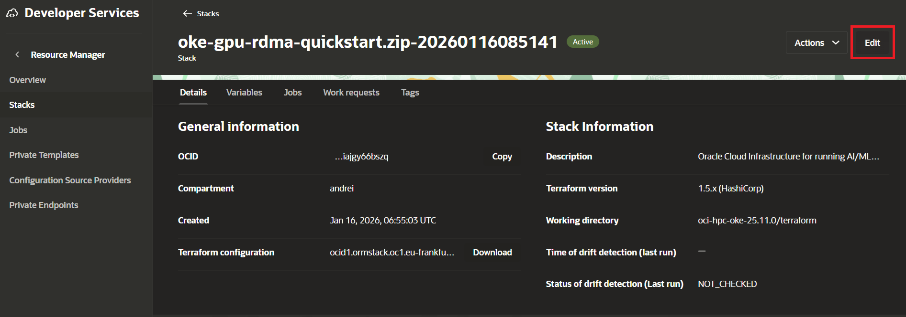
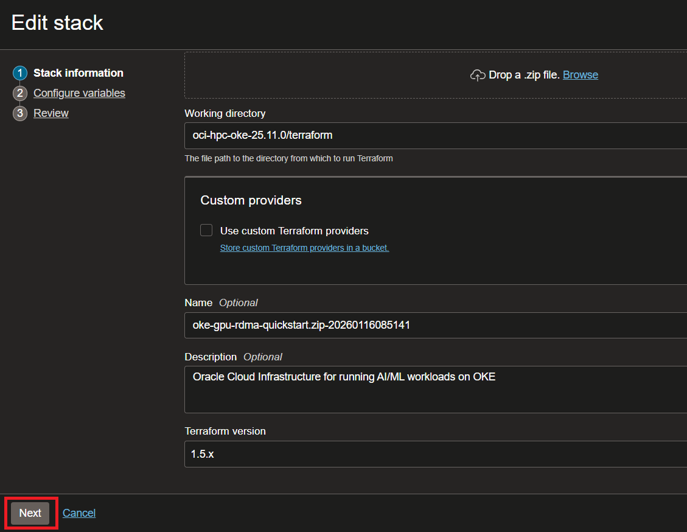
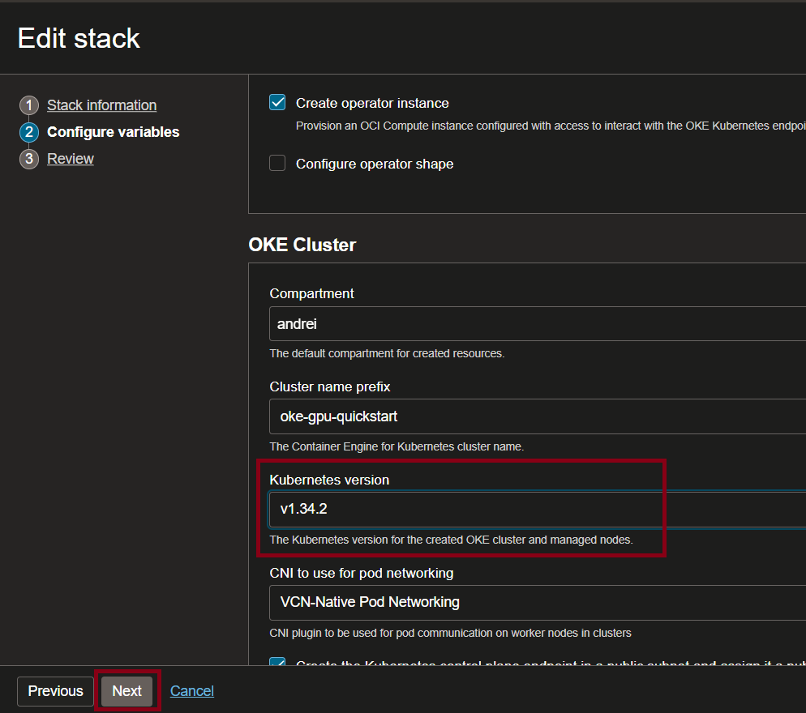
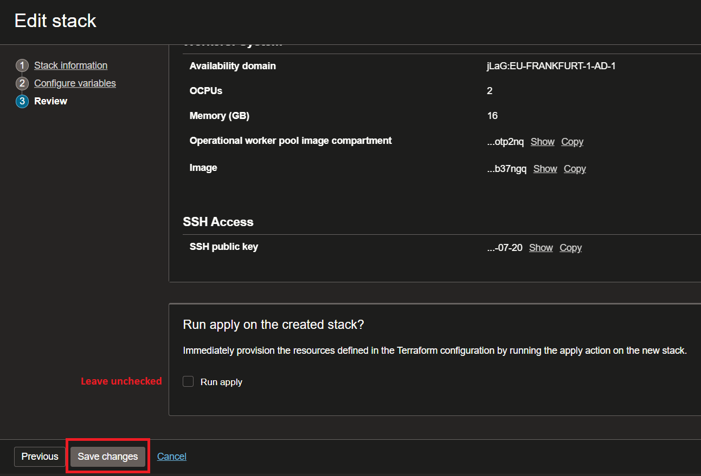
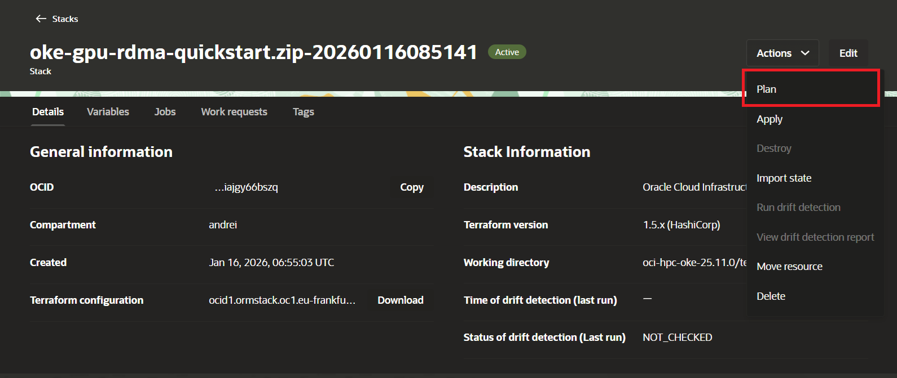
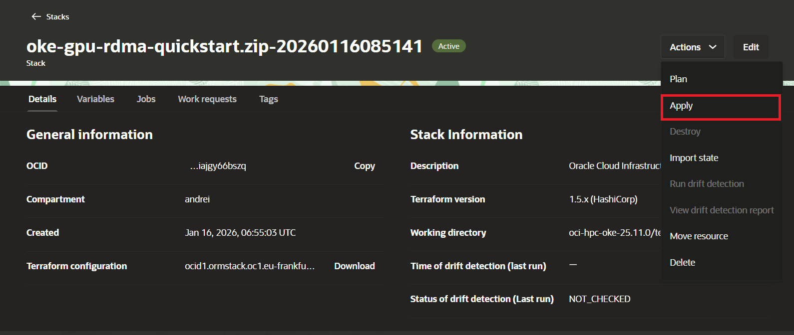
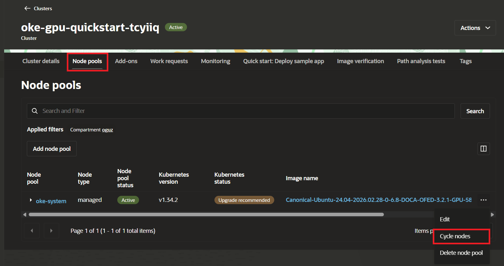
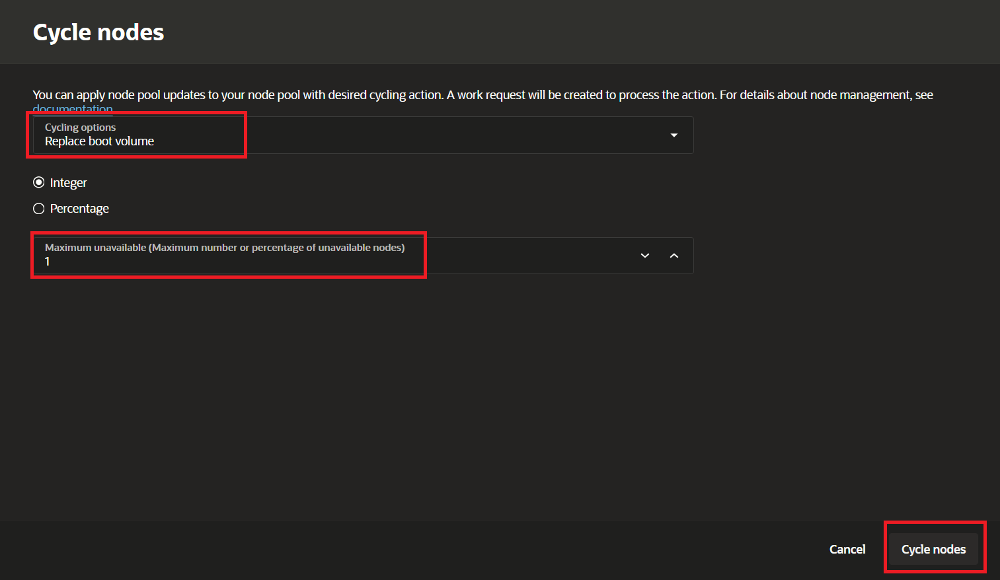

# Upgrading OKE clusters

In order to reduce the downtime during the upgrade process, we can take advantage of the [skew between the OKE control plane version and the worker nodes version](https://kubernetes.io/releases/version-skew-policy/#kubelet) of three minor versions.

The upgrade strategy is:
- Upgrade the control plane to the desired version. This has to be done one minor version at a time.
- Update the configuration of the managed and self-managed worker nodes so that any new nodes created after this point use the same Kubernetes version as the control plane.
- Upgrade the running worker nodes so they converge to the same Kubernetes version as the control plane.

For example, if the cluster is currently running version 1.32.2 and the desired version is 1.35.2, the upgrade plan would be:
- Upgrade the control plane to version 1.33.10
- Upgrade the control plane to version 1.34.2
- Upgrade the control plane to version 1.35.2
- Update the worker node configuration to version 1.35.2
- Upgrade the running worker nodes to version 1.35.2


## Upgrade the control plane and worker configuration

### Terraform managed clusters

This section covers upgrading clusters managed using Terraform or Oracle Resource Manager (ORM).
In case there is a drift between the Terraform state and the actual cluster state, you may need to reconcile the two.

#### Upgrade the OKE control plane and worker configuration

1. Identify what are the versions available to upgrade the OKE control plane:

   ```bash
   export OCI_REGION=eu-frankfurt-1
   export CLUSTER_OCID=ocid1.cluster.oc1.eu-frankfurt-1.....1234
   oci ce cluster get --cluster-id $CLUSTER_OCID --region $OCI_REGION  | jq '.data."available-kubernetes-upgrades"'
   #
   # Output: ["1.34.0", "1.34.1", "1.34.2"]
   ```

2. Update the `kubernetes_version` in the Terraform variables and execute `plan`:

   It's recommended to upgrade the cluster to the version which is closest to desired target version. For example, if current version is `1.33.10` and the desired version is `1.35.2`, the upgrade will be executed in two steps. First you will upgrade to `1.34.2` and then to `1.35.2`.

   When we execute `terraform plan`, the output should reflect the following actions: the OKE control plane will be upgraded to the desired version. For the nodepool (Workers: System), only the nodepool configuration will be updated so that any new nodes use the updated Kubernetes version. For the Cluster Network (Workers: GPU + RDMA), a new instance configuration will be created and associated with the Cluster Network resource so that any new nodes use the updated Kubernetes version. As long as the size of the Cluster Network is unchanged, there should be no impact on the existing running nodes at this stage.

   Update the `kubernetes_version` variable in the Terraform configuration and execute `terraform plan` to preview the changes.

   **Confirm the plan output doesn't include any unexpected destructive changes** (resource destructions or change in size of the existing nodepools or cluster network resources). If there are any other changes, please address the drift before proceeding.

   The expected changes are:

   - replacement of `module.oke.module.workers[0].oci_core_instance_configuration.workers["oke-rdma"]` # replacement of the RDMA instance configuration
   - in place update of `module.oke.module.workers[0].oci_containerengine_node_pool.tfscaled_workers["oke-system"]` # in place update of the system node pool
   - in place update of `module.oke.module.cluster[0].oci_containerengine_cluster.k8s_cluster` # in place upgrade of the Kubernetes cluster

3. If everything looks good, execute `terraform apply` to apply the changes.

   This step upgrades the control plane and updates the worker node configuration, but it does not upgrade the existing running worker nodes yet.
   Once this step is complete, continue with [Upgrade the running worker nodes](#upgrade-the-running-worker-nodes).


#### Clusters managed using Oracle Resource Manager (ORM)

1. Edit the stack in ORM to update the `kubernetes_version` variable.

   

2. Let's move to the next step where we edit the stack variables.

   

3. Edit the `kubernetes_version` variable in the stack variables.

   

4. Save the changes (don't check the `Apply` button).

   

5. Execute `terraform plan` to see the changes that will be applied.

   

6. If everything looks good, execute `terraform apply` to apply the changes.

   


**Note:** If the desired kubernetes version is not available in ORM, you will have to download the terraform configuration zip from the Oracle Resource Manager stack, update the `enum` values available for `kubernetes_version` in the `terraform/schema.yaml`, update the `terraform/schema.yaml` file in the zip and re-upload the zip to ORM.

You can follow the instructions in the [Oracle Resource Manager documentation](https://docs.oracle.com/en-us/iaas/Content/ResourceManager/Tasks/update-stack-tf-config.htm) for these steps.

This step upgrades the control plane and updates the worker node configuration, but it does not upgrade the existing running worker nodes yet.
Once this step is complete, continue with [Upgrade the running worker nodes](#upgrade-the-running-worker-nodes).

### Console managed clusters

#### Upgrade the OKE control plane and worker configuration

1. Upgrade the cluster control plane following the [official documentation](https://docs.oracle.com/en-us/iaas/Content/ContEng/Tasks/contengupgradingk8smasternode.htm) until the desired version is reached. (considering the [Kubernetes version skew policy](https://kubernetes.io/releases/version-skew-policy/#kubelet))

2. Update the configuration of the managed nodepools so that new nodes use the same Kubernetes version as the cluster control plane using the script [update-oke-nodepool-cloud-init.py](files/update-oke-nodepool-cloud-init.py).

```bash
export NODEPOOL_OCID=ocid1.nodepool.oc1.eu-frankfurt-1.aaaaaaaa6aoyk7becycxk7e4r63so7enbsikftphpuxrop3kvnrebwzxekeq
export REGION=eu-frankfurt-1
test -f update-oke-nodepool-cloud-init.py || curl -L -o update-oke-nodepool-cloud-init.py https://raw.githubusercontent.com/oracle-quickstart/oci-hpc-oke/refs/heads/main/docs/files/update-oke-nodepool-cloud-init.py
uv run update-oke-nodepool-cloud-init.py  --mode nodepool --nodepool-id $NODEPOOL_OCID --region $REGION --desired-k8s-version v1.35.2 
```

3. Update the cloud-init of the GPU + RDMA self-managed nodes so that new nodes use the same Kubernetes version as the cluster control plane using the script [update-oke-nodepool-cloud-init.py](files/update-oke-nodepool-cloud-init.py).

```bash
export CLUSTER_NETWORK_OCID=ocid1.clusternetwork.oc1.eu-frankfurt-1.amaaaaaa2bemolaapkmsvwckms4impqe4w6vn5vlxuwigxzx3dcbgqhyn2sq
export REGION=eu-frankfurt-1
test -f update-oke-nodepool-cloud-init.py || curl -L -o update-oke-nodepool-cloud-init.py https://raw.githubusercontent.com/oracle-quickstart/oci-hpc-oke/refs/heads/main/docs/files/update-oke-nodepool-cloud-init.py
uv run update-oke-nodepool-cloud-init.py  --mode instance-config --cluster-network-id $CLUSTER_NETWORK_OCID --region $REGION --desired-k8s-version v1.35.2 
```

4. At this point, the control plane and worker node configuration are aligned on the target Kubernetes version. Existing running worker nodes are still on their previous version and must be upgraded separately.
   Continue with [Upgrade the running worker nodes](#upgrade-the-running-worker-nodes).

## Upgrade the running worker nodes

This section is applicable after the control plane and worker node configuration have already been updated to the target Kubernetes version. It applies to both Terraform managed clusters and console managed clusters.

### Upgrading the managed nodes

During this step, each managed node is upgraded one at a time using boot volume replacement. Cordon and Drain operations are carried out as part of the node cycle operation.

1. Upgrade the nodes which belong to the nodepools by [Replacing the Boot Volumes](https://docs.oracle.com/en-us/iaas/Content/ContEng/Tasks/contengupgradingimageworkernode_topic-InPlace_Worker_Node_Update_By_Cycling_and_Replacing_Boot_Volumes.htm).

  Navigate to the OKE cluster and select the `Node Pools` tab.

  For the node pool you want to upgrade, click on the three-dot menu in the right side and select `Cycle Nodes`.

  

2. Configure the node-cycle parameters.

  Choose the `Replace Boot Volume` cycle option, set the maximum number of unavailable nodes to 1 and click `Cycle Nodes`.

  


### Upgrading the GPU + RDMA self-managed nodes

During this step, each `GPU + RDMA node` is upgraded one at a time using boot volume replacement. Cordon and Drain operations are carried out as part of the node cycle operation.

Prerequisites:
- The node which executes this step must have `kubectl` installed and configured to connect to the cluster.

We will rely on the [bvr-script.py](files/bvr-script.py) to execute this upgrade. More details about the script can be found [here](replacing-the-boot-volume-of-self-managed-nodes.md): 


Update in the command below the:
- `K8S_node_to_upgrade` with the Kubernetes node name of the node you want to upgrade.
- `COMPARTMENT_OCID` with the OCID of the compartment where the node is located.
- `REGION` with the OCI region where your cluster is located.

```bash
export K8S_node_to_upgrade=10.30.1.242
export COMPARTMENT_OCID=ocid1.compartment.oc1..aaaaaaaaqi3if6t4n24qyabx5pjzlw6xovcbgugcmatavjvapyq3jfb4diqq
export REGION=eu-frankfurt-1
test -f bvr-script.py || curl -L -o bvr-script.py https://raw.githubusercontent.com/oracle-quickstart/oci-hpc-oke/refs/heads/main/docs/files/bvr-script.py
uv run bvr-script.py -c $COMPARTMENT_OCID --auth instance_principal --region $REGION $K8S_node_to_upgrade --desired-k8s-version v1.35.2
```
