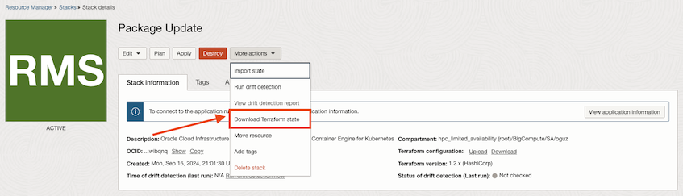
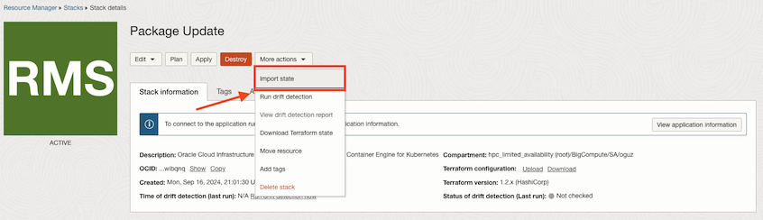

# Updating the OKE packages in an existing cluster
To update the OKE packages in your cluster deployed using the OCI Resource Manager stack, you will need to edit the Terraform state of your deployment.

### 1. Download the stack state file
1. Go to your deployment stack by following **Menu > Developer Services > Resource Manager > Stacks** in the web console.

2. Click on the name of your stack. In the **Stack details** page, click **More actions** and **Download Terraform state**.



### 2. Open the downloaded Terraform state file with your favorite code editor
The state file is a JSON file. You will update the cloud init in the state, which adds the Ubuntu repo for OKE packages.

Using your favorite code editor:

1. Increment the `serial` value in line 4 by one (for example change it to 100 from 99).

2. Search for `[trusted=yes]` in the state file. Depending on how many worker pools you have, you will have multiple results.

3. In the line that starts with `"content"` that you found by searching for `[trusted=yes]`, change the old repo that starts with `https` to the new repos. The old link will have `hpc_limited_availability` in it.
  
   Example of the old repo: `https://objectstorage.us-phoenix-1.oraclecloud.com/../n/hpc_limited_availability/b/oke_node_repo`

   The new repos:

   - Kubernetes 1.27 - https://odx-oke.objectstorage.us-sanjose-1.oci.customer-oci.com/n/odx-oke/b/okn-repositories/o/prod/ubuntu-jammy/kubernetes-1.27
   - Kubernetes 1.28 - https://odx-oke.objectstorage.us-sanjose-1.oci.customer-oci.com/n/odx-oke/b/okn-repositories/o/prod/ubuntu-jammy/kubernetes-1.28
   - Kubernetes 1.29 - https://odx-oke.objectstorage.us-sanjose-1.oci.customer-oci.com/n/odx-oke/b/okn-repositories/o/prod/ubuntu-jammy/kubernetes-1.29
   
> [!IMPORTANT]  
> Make sure you use the Kubernetes version that matches your existing OKE cluster.

The first part of `content` should look like below:
```
"content": "\"apt\":\n  \"sources\":\n    \"oke-node\":\n      \"source\": \"deb [trusted=yes] https://odx-oke.objectstorage.us-sanjose-1.oci.customer-oci.com/n/odx-oke/b/okn-repositories/o/prod/ubuntu-jammy/kubernetes-1.29\n        stable main\ ....
```

### 3. Import the updated state file to your stack
1. In the **Stack details** page. click **More actions** and **Import state**.
2. Choose the state file you edited in the previous step, and click **Import**.



This will create an Import state job. Once the job is succeeded, the new nodes you deploy in your cluster will use the correct OKE packages.

## Some of my nodes were deployed before I edited the Terraform state. How can I update the packages on them?
The above steps will only be valid for new nodes deployed after the change is applied. If you have some nodes that were deployed but did not join the cluster, SSH into the node and run the below commands to join it to your OKE cluster.

> [!IMPORTANT]  
> Make sure you use the Kubernetes version that matches your existing OKE cluster. The second command below has version 1.29, change it accordingly.

```
sudo rm /etc/apt/sources.list.d/oke-node.list

sudo add-apt-repository -y 'deb [trusted=yes] https://odx-oke.objectstorage.us-sanjose-1.oci.customer-oci.com/n/odx-oke/b/okn-repositories/o/prod/ubuntu-jammy/kubernetes-1.29 stable main'

sudo apt install -y oci-oke-node-all*

sudo oke bootstrap --manage-gpu-services --crio-extra-args "--root /var/lib/oke-crio"
```
