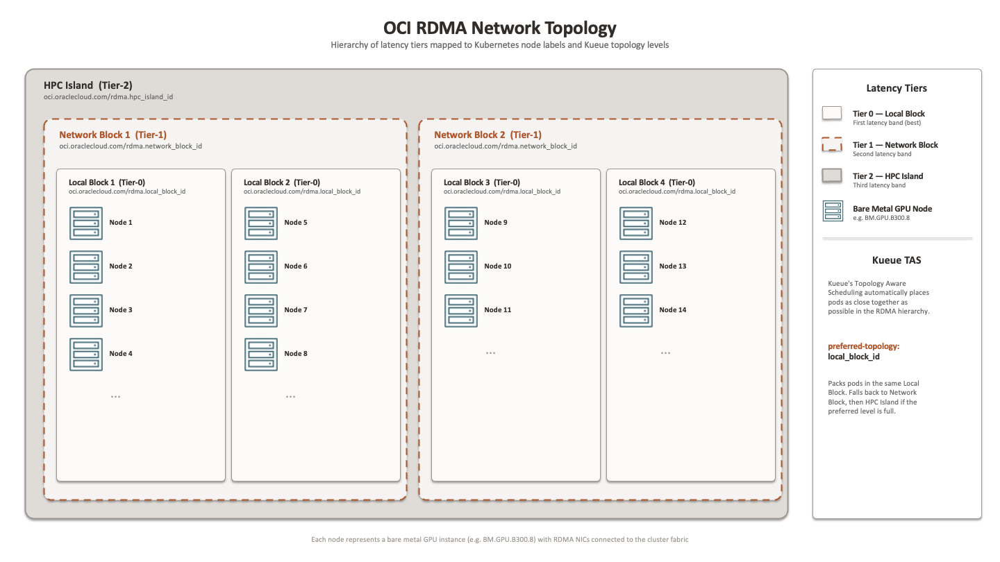

# Using RDMA Network Locality When Running Workloads on OKE

This guide explains how to leverage RDMA network topology information to optimize workload placement and performance in Oracle Kubernetes Engine (OKE). By using network locality, you can ensure that distributed workloads are scheduled on nodes with optimal network proximity, reducing latency and maximizing throughput for GPU-accelerated applications.

> [!IMPORTANT]
> To use the instructions in this guide, you must have a dedicated capacity pool and you must create a capacity topology. Otherwise, `rdmaTopologyData` in instance metadata service and related node labels in OKE will not be available.

## Overview of Network Locality
Generative AI workloads drive a different set of engineering tradeoffs than traditional cloud workloads. So, we designed a purpose-built GenAI network tailored to the needs of the best-of-breed Generative AI workloads.

When possible, running a job using the nodes in the same Local Block will provide the best performance. Because the number of nodes in a Local Block is limited; depending on the number of nodes you have, the number of your concurrent jobs running, and the size of your jobs, you might need to use the nodes from another Local Block in the same Network Block or from another Network Block.

Local Block is the first latency band (Tier-0), Network Block is the second latency band (Tier-1), and HPC Island is the third latency band (Tier-2) in OCI's RDMA networks. You can read [this blog post](https://blogs.oracle.com/cloud-infrastructure/post/first-principles-zettascale-oci-superclusters) and watch the [YouTube video](https://www.youtube.com/watch?v=cZy22n5Ih78) for learning more about OCI's RDMA network design.



## Network Tier Information
When you have a dedicated capacity pool and a capacity topology created for the availability domain, the following information will be available in the instance metadata service for bare metal GPU shapes:

```
curl -H 'Authorization: Bearer Oracle' http://169.254.169.254/opc/v2/host/rdmaTopologyData

{
  "customerHPCIslandId": "ocid1.hpcisland.oc1.iad.anuwcljrg5pyaeycajoqlss...",
  "customerHostId": "ocid1.computebaremetalhost.oc1.iad.anuwcljrg5pyaeycu...",
  "customerLocalBlock": "ocid1.computelocalblock.oc1.iad.anuwcljrg5pyaeyc...",
  "customerNetworkBlock": "ocid1.computenetworkblock.oc1.iad.anuwclddsdef..."
}
```

## Node Labels

When the locality information is available in the instance metadata service, OKE will add the following labels to your nodes during bootstrapping:

```
oci.oraclecloud.com/rdma.hpc_island_id
oci.oraclecloud.com/rdma.network_block_id
oci.oraclecloud.com/rdma.local_block_id
oci.oraclecloud.com/rdma.host_id
```
The values of the labels are hashes of the information available in instance metadata and they will be different than the OCIDs above.

Example:
```
oci.oraclecloud.com/rdma.hpc_island_id=af7ubvouuyq
oci.oraclecloud.com/rdma.network_block_id=7xmzl4p4wba
oci.oraclecloud.com/rdma.local_block_id=4tjxbt4s6ua
oci.oraclecloud.com/rdma.host_id=ab3zs7y7v7q
```

## Scheduling Methods

| Method | Requires Manual Label Values | Auto Fallback |
|--------|----------------------|---------------|
| **Kueue (recommended)** | No | Yes |
| Node Affinity | Yes | With soft rules |
| Pod Affinity | No | With soft rules |
| Node Ordering Init Container | No | No |

## Kueue with Topology Aware Scheduling (Recommended)

> [!NOTE]
> Starting with stack v26.3.0, Kueue is deployed by default along with the Topology, ResourceFlavor, ClusterQueue, and LocalQueue resources. If you deployed using v26.3.0 or later, skip to [Step 6](#step-6-submit-a-job).

Kueue's **Topology Aware Scheduling (TAS)** automatically places pods as close together as possible in the RDMA network hierarchy. You define a preferred topology level (e.g., Local Block), and Kueue will pack pods there if capacity allows. If not, it progressively falls back to Network Block, then HPC Island — no manual label lookups or affinity rules required.

This is the recommended approach because:
- **No label values to manage** — Kueue reads the topology from node labels automatically
- **Automatic fallback** — jobs are never stuck waiting; Kueue finds the best available placement
- **Integrates with quotas** — ClusterQueue resource quotas prevent overcommitment

### Step 1: Install Kueue

```sh
helm install kueue oci://registry.k8s.io/kueue/charts/kueue --version="0.16.3" --create-namespace --namespace=kueue-system
```

### Step 2: Create a Topology

Define how nodes are grouped at different hierarchy levels.

```yaml
apiVersion: kueue.x-k8s.io/v1beta1
kind: Topology
metadata:
  name: "oci-rdma"
spec:
  levels:
  - nodeLabel: "oci.oraclecloud.com/rdma.hpc_island_id"
  - nodeLabel: "oci.oraclecloud.com/rdma.network_block_id"
  - nodeLabel: "oci.oraclecloud.com/rdma.local_block_id"
  - nodeLabel: "kubernetes.io/hostname"
```

```bash
kubectl apply -f topology.yaml
```

### Step 3: Create a ResourceFlavor

Define a flavor for your node type and reference the topology.

> [!NOTE]
> The examples below use `BM.GPU.H100.8` as the shape. Change the shape and resource names to match your GPU shape (e.g., `BM.GPU.B200.8`, `BM.GPU.MI300X.8`).

```yaml
apiVersion: kueue.x-k8s.io/v1beta1
kind: ResourceFlavor
metadata:
  name: "bm-gpu-h100-8"
spec:
  nodeLabels:
    node.kubernetes.io/instance-type: "BM.GPU.H100.8"
  topologyName: "oci-rdma"
```

```bash
kubectl apply -f resourceflavor.yaml
```

### Step 4: Create a ClusterQueue

Define a shared queue of resources available to all namespaces.

```yaml
apiVersion: kueue.x-k8s.io/v1beta1
kind: ClusterQueue
metadata:
  name: "bm-gpu-h100-8"
spec:
  namespaceSelector: {}
  resourceGroups:
  - coveredResources: ["cpu", "memory", "nvidia.com/gpu"]
    flavors:
    - name: "bm-gpu-h100-8"
      resources:
      - name: "cpu"
        nominalQuota: 1000
      - name: "memory"
        nominalQuota: 8000Gi
      - name: "nvidia.com/gpu"
        nominalQuota: 800
```

```bash
kubectl apply -f clusterqueue.yaml
```

### Step 5: Create a LocalQueue

Create a namespace-specific queue linked to the cluster queue.

```yaml
apiVersion: kueue.x-k8s.io/v1beta1
kind: LocalQueue
metadata:
  name: bm-gpu-h100-8
spec:
  clusterQueue: bm-gpu-h100-8
```

```bash
kubectl apply -f localqueue.yaml
```

### Step 6: Submit a Job

Add the `kueue.x-k8s.io/queue-name` label and the `kueue.x-k8s.io/podset-preferred-topology` annotation to your workload. Kueue will prefer placing all pods within the same topology domain. If that is not possible, Kueue will progressively move up the hierarchy until it finds a level where the job fits.

```yaml
apiVersion: batch/v1
kind: Job
metadata:
  generateName: tas-sample-preferred-
  labels:
    kueue.x-k8s.io/queue-name: bm-gpu-h100-8
spec:
  parallelism: 2
  completions: 2
  completionMode: Indexed
  template:
    metadata:
      annotations:
        kueue.x-k8s.io/podset-preferred-topology: "oci.oraclecloud.com/rdma.local_block_id"
    spec:
      containers:
      - name: dummy-job
        image: registry.k8s.io/e2e-test-images/agnhost:2.53
        args: ["pause"]
        resources:
          requests:
            cpu: "1"
            memory: "200Mi"
      restartPolicy: Never
```

```bash
kubectl apply -f job.yaml
```

You can also use `kueue.x-k8s.io/podset-required-topology` instead of `podset-preferred-topology` if you want strict placement (job will wait rather than fall back to a higher tier).

---

## Alternative Methods

The following methods can be used when Kueue is not available, or for workloads that need direct control over scheduling.

### Kubernetes Node Affinity
You can use the RDMA topology labels to create affinity rules for your workloads. Visit [this link](https://kubernetes.io/docs/concepts/scheduling-eviction/assign-pod-node/) if you want to learn more about using affinity rules on Kubernetes.

Note that because we're using soft rules (`preferredDuringSchedulingIgnoredDuringExecution`), the scheduler will try to find a node that meets the rules. If a matching node is not available, the scheduler will still schedule the pod.

You can use hard rules instead (`requiredDuringSchedulingIgnoredDuringExecution`), but that means the scheduler can't schedule the pod unless the rules are met. So your jobs might not start depending on node availability.

When using node affinity, you will need to provide the values of the `oci.oraclecloud.com/rdma.local_block_id`, `oci.oraclecloud.com/rdma.network_block_id`, and `oci.oraclecloud.com/rdma.hpc_island_id` labels. Instead of hardcoding them, you can use tools like `sed` or `yq` to change them when you're scheduling jobs. Or if you're using Helm, you can templatize those values.

```yaml
apiVersion: apps/v1
kind: Deployment
metadata:
  name: node-affinity-example
spec:
  replicas: 3
  selector:
    matchLabels:
      app: node-affinity-app
  template:
    metadata:
      labels:
        app: node-affinity-app
    spec:
      affinity:
        nodeAffinity:
          preferredDuringSchedulingIgnoredDuringExecution:
            - weight: 100
              preference:
                matchExpressions:
                  - key: oci.oraclecloud.com/rdma.local_block_id
                    operator: In
                    values:
                      - 5tjxbt5s6ua
            - weight: 50
              preference:
                matchExpressions:
                  - key: oci.oraclecloud.com/rdma.network_block_id
                    operator: In
                    values:
                      - 7xmzl5p5wba
            - weight: 25
              preference:
                matchExpressions:
                  - key: oci.oraclecloud.com/rdma.hpc_island_id
                    operator: In
                    values:
                      - af7ubvouuyq
      containers:
        - name: nginx
          image: nginx
          ports:
            - containerPort: 80
          resources:
            requests:
              cpu: "100m"
              memory: "128Mi"
            limits:
              cpu: "500m"
              memory: "256Mi"
```

### Kubernetes Pod Affinity
You can use the RDMA topology labels as topology keys for pod affinity rules. Visit [this link](https://kubernetes.io/docs/concepts/scheduling-eviction/assign-pod-node/) if you want to learn more about using affinity rules on Kubernetes.

Note that because we're using soft rules (`preferredDuringSchedulingIgnoredDuringExecution`), the scheduler will try to find a node that meets the rules. If a matching node is not available, the scheduler will still schedule the pod.

You can use hard rules instead (`requiredDuringSchedulingIgnoredDuringExecution`), but that means the scheduler can't schedule the pod unless the rules are met. So your jobs might not start depending on node availability.

When using pod affinity, because you're relying on the `topologyKey` instead of node labels, you don't need to provide the values for the `oci.oraclecloud.com/rdma.local_block_id`, `oci.oraclecloud.com/rdma.network_block_id`, and `oci.oraclecloud.com/rdma.hpc_island_id` labels.

> [!NOTE]
> Inter-pod affinity and anti-affinity require substantial amounts of processing which can slow down scheduling in large clusters significantly. We do not recommend using them in clusters larger than several hundred nodes.
> Pod anti-affinity requires nodes to be consistently labeled, in other words, every node in the cluster must have an appropriate label matching topologyKey. If some or all nodes are missing the specified topologyKey label, it can lead to unintended behavior.

```yaml
apiVersion: apps/v1
kind: Deployment
metadata:
  name: pod-affinity-example
spec:
  replicas: 3
  selector:
    matchLabels:
      app: pod-affinity-app
  template:
    metadata:
      labels:
        app: pod-affinity-app
    spec:
      affinity:
        podAffinity:
          preferredDuringSchedulingIgnoredDuringExecution:
            - weight: 100
              podAffinityTerm:
                labelSelector:
                  matchExpressions:
                    - key: app
                      operator: In
                      values:
                        - pod-affinity-app
                topologyKey: oci.oraclecloud.com/rdma.local_block_id
            - weight: 50
              podAffinityTerm:
                labelSelector:
                  matchExpressions:
                    - key: app
                      operator: In
                      values:
                        - pod-affinity-app
                topologyKey: oci.oraclecloud.com/rdma.network_block_id
            - weight: 25
              podAffinityTerm:
                labelSelector:
                  matchExpressions:
                    - key: app
                      operator: In
                      values:
                        - pod-affinity-app
                topologyKey: oci.oraclecloud.com/rdma.hpc_island_id
      containers:
        - name: nginx
          image: nginx
          ports:
            - containerPort: 80
          resources:
            requests:
              cpu: "100m"
              memory: "128Mi"
            limits:
              cpu: "500m"
              memory: "256Mi"
```

### Node Ordering Script as Init Container

For workloads that use MPI (Message Passing Interface) and can leverage an ordered hostfile or rankfile, you can use the [Node Ordering script](../docker/node-ordering/node_ordering.py) to optimize node selection. This approach is particularly useful for:

- MPI-based workloads that accept hostfiles (e.g., `mpirun`)
- Distributed training jobs that benefit from network locality
- Custom scheduling requirements not covered by Kubernetes schedulers

The script generates ordered hostfiles/rankfiles using the `customerLocalBlock` information from the instance metadata service, ensuring nodes are ordered by network proximity.

#### Example: RCCL Tests with MPI Operator

The following example demonstrates running RCCL tests with the [MPI Operator](https://github.com/kubeflow/mpi-operator) using the Node Ordering script:

```yaml
apiVersion: kubeflow.org/v2beta1
kind: MPIJob
metadata:
  name: rccl-tests
spec:
  slotsPerWorker: 8
  runPolicy:
    cleanPodPolicy: Running
  mpiReplicaSpecs:
    Launcher:
      replicas: 1
      template:
          spec:
            initContainers:
            - name: node-ordering
              image: iad.ocir.io/hpc_limited_availability/node-ordering:mpi-operator-port-2222-v0.1
              volumeMounts:
              - name: node-ordering
                mountPath: "/node-ordering"
              - name: mpi-job-config
                mountPath: /etc/mpi
              - name: ssh-auth
                mountPath: /root/.ssh
            volumes:
            - name: node-ordering
              emptyDir: {}
            containers:
            - image: iad.ocir.io/hpc_limited_availability/oke/rccl-tests:rocm-6.3.2-OFED-24.10-1.1.4.0
              name: rccl-tests
              volumeMounts:
              - name: node-ordering
                mountPath: "/node-ordering"
              env:
              - name: OMPI_ALLOW_RUN_AS_ROOT
                value: "1"
              - name: OMPI_ALLOW_RUN_AS_ROOT_CONFIRM
                value: "1"
              command:
              - /bin/bash
              - -c
              - |
               sysctl --system
               NUM_GPUS=8
               NUM_HOSTS=$(cat /node-ordering/ordered_hostfile | wc -l)
               NP=$(($NUM_HOSTS*$NUM_GPUS))
               mpirun --allow-run-as-root \
               -mca plm_rsh_args "-p 2222" \
               --bind-to numa \
               --mca oob_tcp_if_exclude docker,lo \
               --mca btl ^openib \
               -x NCCL_DEBUG=VERSION \
               -x NCCL_IB_HCA==mlx5_0,mlx5_2,mlx5_3,mlx5_4,mlx5_5,mlx5_7,mlx5_8,mlx5_9 \
               -x NCCL_SOCKET_IFNAME=eth0 \
               -x NCCL_IB_TC=41 \
               -x NCCL_IB_SL=0 \
               -x NCCL_IB_GID_INDEX=3 \
               -x NCCL_IB_QPS=2 \
               -x NCCL_IB_SPLIT_DATA_ON_QPS=4 \
               -x NCCL_ALGO=Ring \
               -hostfile /node-ordering/ordered_hostfile \
               -N 8 -np $NP \
               /workspace/rccl-tests/build/all_reduce_perf -b 1G -e 16G -f 2 -g 1
              resources:
                requests:
                  cpu: 2
                  memory: 128Mi
    Worker:
      replicas: 2
      template:
        metadata:
        spec:
          dnsPolicy: ClusterFirstWithHostNet
          hostNetwork: true
          containers:
          - image: iad.ocir.io/hpc_limited_availability/oke/rccl-tests:rocm-6.3.2-OFED-24.10-1.1.4.0
            securityContext:
              privileged: true
              capabilities:
                add: [IPC_LOCK, SYS_PTRACE]
            name: nccl
            command:
            - /bin/bash
            - -c
            - mkdir -p /var/run/sshd; /usr/sbin/sshd -D -p 2222 || sleep 999999999;
            ports:
            - { name: mpijob-port, containerPort: 2222, protocol: TCP }
            resources:
              requests:
                cpu: 100
                memory: 750Gi
                amd.com/gpu: 8
              limits:
                amd.com/gpu: 8
            volumeMounts:
              - mountPath: /dev/shm
                name: dshm
          volumes:
            - emptyDir:
                medium: Memory
              name: dshm
```

### Volcano

Volcano added the [Network Topology Aware Scheduling](https://volcano.sh/en/docs/network_topology_aware_scheduling/) feature in v1.11.0. The feature currently requires you to create the topology information manually. Once the functionality to [support identifying network topology from node labels and converted into hyperNode resources](https://github.com/volcano-sh/volcano/pull/4146) is added to Volcano, this section of the guide will be updated with the instructions.
